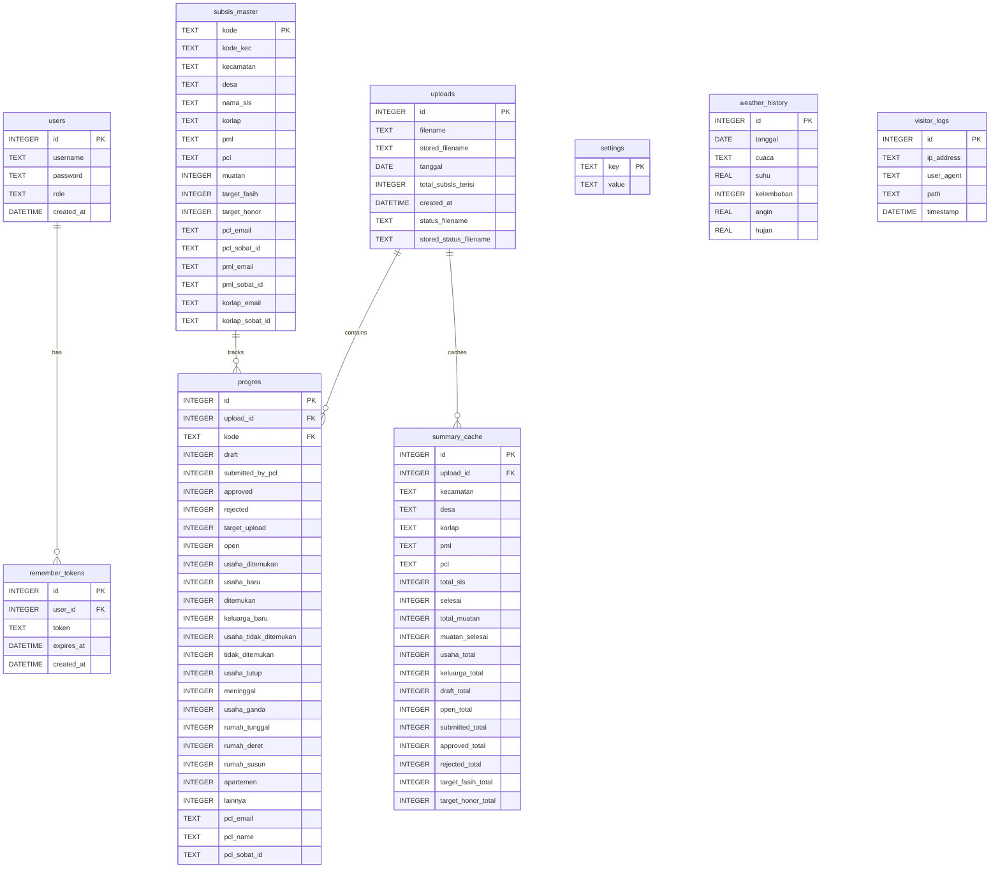
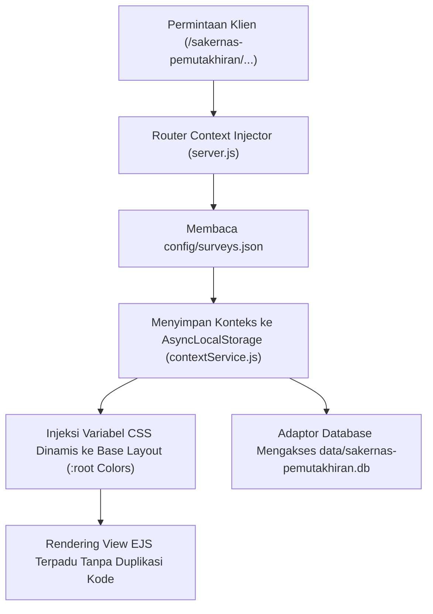

# LAPORAN PERANCANGAN DAN IMPLEMENTASI SISTEM
# (*SYSTEM DESIGN AND IMPLEMENTATION REPORT*)

**Nama Sistem:** Dashboard Pemantauan Lapangan Sensus Ekonomi 2026 (SE2026) & Multi-Survei BPS PPU  
**Institusi Pengembang:** Badan Pusat Statistik (BPS) Kabupaten Penajam Paser Utara  
**Versi Sistem:** 2.3.0  
**Tanggal Dokumen:** Agustus 2026  
**Klasifikasi Dokumen:** Laporan Teknis Rekayasa Perangkat Lunak (*Software Engineering Technical Report*)

---

## DAFTAR ISI
1. [Ringkasan Eksekutif & Konteks Bisnis](#1-ringkasan-eksekutif--konteks-bisnis)
2. [Analisis Kebutuhan Sistem (*System Requirements*)](#2-analisis-kebutuhan-sistem-system-requirements)
3. [Arsitektur Perangkat Lunak (*Software Architecture*)](#3-arsitektur-perangkat-lunak-software-architecture)
4. [Perancangan Basis Data (*Database Design & Modeling*)](#4-perancangan-basis-data-database-design--modeling)
5. [Desain dan Implementasi Komponen Utama (*Core Modules Implementation*)](#5-desain-dan-implementasi-komponen-utama-core-modules-implementation)
   - 5.1. Mesin Parsing & Rekonsiliasi Data Excel FASIH (*Excel Reconciliation Engine*)
   - 5.2. Sistem Peringatan Dini (*Early Warning System & Targeted Supervision*)
   - 5.3. Asisten Pemantauan Cerdas Berbasis AI / KIPP (*AI Agent Service*)
   - 5.4. Layanan Notifikasi & Broadcast WhatsApp (*Automated Messaging Engine*)
   - 5.5. Modul Pemetaan Spasial & GIS (*Spatial Progress Mapping*)
   - 5.6. Modul Deteksi Anomali Data (*Google Sheets Real-time Anomaly Sync*)
   - 5.7. Mesin Ekspor Laporan (*PDF & Excel Report Generator*)
6. [Arsitektur Multi-Survei Dinamis (*Dynamic Multi-Survey Template System*)](#6-arsitektur-multi-survei-dinamis-dynamic-multi-survey-template-system)
7. [Aspek Keamanan, Keandalan, dan Kinerja (*Security, Reliability & Performance*)](#7-aspek-keamanan-keandalan-dan-kinerja-security-reliability--performance)
8. [Struktur Kode dan Organisasi Berkas (*Codebase Organization*)](#8-struktur-kode-dan-organisasi-berkas-codebase-organization)
9. [Panduan Penerapan & Operasional (*Deployment & DevOps*)](#9-panduan-penerapan--operasional-deployment--devops)
10. [Kesimpulan dan Rencana Pengembangan Lanjutan](#10-kesimpulan-dan-rencana-pengembangan-lanjutan)

---

## 1. Ringkasan Eksekutif & Konteks Bisnis

### 1.1. Latar Belakang
Kegiatan lapangan **Sensus Ekonomi 2026 (SE2026)** merupakan sensus nasional berskala masif yang diselenggarakan oleh Badan Pusat Statistik untuk mendata seluruh unit usaha/perusahaan di Indonesia. Di **Kabupaten Penajam Paser Utara (PPU)**—yang kini berkedudukan strategis sebagai kawasan penyangga dan pintu gerbang Ibu Kota Nusantara (IKN)—dinamika ekonomi, mobilitas pelaku usaha, dan bentang geografis yang luas menghadirkan tantangan pengawasan lapangan yang kompleks:

1. **Kendala Geografis & Efisiensi Anggaran Operasional:** Luasnya wilayah PPU (mencakup Kecamatan Penajam, Waru, Babulu, dan Sepaku) memerlukan biaya transportasi dan waktu pengawasan yang sangat tinggi. Pola pengawasan lapangan konvensional berbasis *random inspection* (pemeriksaan acak) tidak lagi efisien. BPS PPU memerlukan strategi **Targeted Supervision** (pengawasan terarah dan tepat sasaran) dengan memprioritaskan kunjungan lapangan hanya pada petugas atau wilayah yang teridentifikasi bermasalah atau berisiko tinggi (*at-risk*).
2. **Keterbatasan Akses Portal Pusat (FASIH):** Dashboard pemantauan terpusat memiliki hak akses terbatas (khusus akun pimpinan/tertentu) dan memerlukan koneksi VPN (*Virtual Private Network*) internal yang rentan mengalami *bottleneck*, latensi tinggi, serta sulit diakses cepat oleh staf teknis, Koordinator Lapangan (Korlap), dan Pengawas Lapangan (PML) di lapangan.
3. **Kebutuhan Pengambilan Keputusan Real-Time:** Manajemen membutuhkan indikator progres harian yang terintegrasi dengan target milestone nasional (Milestone 1: 25%, Milestone 2: 40%, Milestone 3: 100%), metrik produktivitas petugas pencacah lapangan (PCL), serta deteksi dini anomali isian dokumen.

### 1.2. Tujuan Pembangunan Sistem
Sistem Dashboard Pemantauan Lapangan SE2026 PPU dibangun dengan tujuan:
* Menyediakan platform monitoring lapangan yang **ringan, sangat responsif, dan mudah diakses** tanpa hambatan VPN.
* Mengotomatisasi analisis performa lapangan melalui **Early Warning System (EWS)** dan algoritma proyeksi laju penyelesaian.
* Mengintegrasikan asisten cerdas berbasis AI (**KIPP / Kelompok Informasi dan Performa Petugas**) dengan kemampuan eksekusi kueri analitik berbasis bahasa alami (*Natural Language Querying*).
* Menyediakan mesin otomatisasi notifikasi WhatsApp untuk mendistribusikan kartu performa dan peringatan keterlambatan langsung ke ponsel petugas.
* Menyediakan arsitektur **Multi-Survey Template** yang memungkinkan sistem diperluas untuk survei BPS lainnya (seperti Sakernas Listing dan Sakernas CAPI) secara instan tanpa menulis ulang kode dasar (*zero code duplication*).

---

## 2. Analisis Kebutuhan Sistem (*System Requirements*)

### 2.1. Kebutuhan Fungsional (*Functional Requirements*)
| Kode FR | Modul / Fitur | Deskripsi Kebutuhan |
| :--- | :--- | :--- |
| **FR-01** | **Otentikasi & RBAC** | Pengelolaan hak akses berjenjang (Administrator, Korlap, User/Guest) dengan sesi persisten SQLite dan proteksi CSRF. |
| **FR-02** | **Unggah & Rekonsiliasi Data** | Unggah berkas Excel rekap progres FASIH harian, deteksi header otomatis, parsing muatan dokumen/usaha/keluarga, dan peremajaan basis data. |
| **FR-03** | **Dasbor Metrik & Tren Harian** | Visualisasi KPI agregat (Total SLS, Dokumen Selesai, Usaha Ditemukan, Beban Honor), progress bar milestone, dan grafik tren kumulatif harian. |
| **FR-04** | **Hierarki Pemantauan Wilayah** | Drill-down statistik secara bertingkat: Kecamatan $\rightarrow$ Desa/Kelurahan $\rightarrow$ Satuan Lingkungan Setempat (SLS/Sub-SLS). |
| **FR-05** | **Pemantauan Performa Petugas** | Dasbor analitik kinerja individual dan grup untuk PCL, PML, dan Korlap, termasuk rasio verifikasi dan beban kerja per orang. |
| **FR-06** | **Early Warning System (EWS)** | Identifikasi otomatis petugas *stuck* (tanpa progres $\ge 3$ hari), petugas berisiko gagal deadline (*at-risk*), serta peringkat performa terendah. |
| **FR-07** | **Peta Sebaran GIS** | Peta interaktif berbasis Leaflet dengan layer poligon batas wilayah KML PPU (`Batas Wilayah PPU.kml`) yang diberi warna tematik (*choropleth*) sesuai persentase progres. |
| **FR-08** | **Deteksi Anomali Google Sheets** | Sinkronisasi dua arah/real-time dengan Google Sheets daftar anomali isian lapangan untuk pembinaan teknis petugas. |
| **FR-09** | **Asisten Virtual AI (KIPP)** | Chatbot interaktif menggunakan model Google Gemini dengan fungsi kueri database cerdas (*NL-to-SQL execution*) dan ringkasan eksekutif otomatis. |
| **FR-10** | **Automasi Pesan WhatsApp** | Integrasi gateway WhatsApp (Baileys) untuk broadcast progres massal, kirim kartu kinerja personal PCL/PML, dan alert anomali. |
| **FR-11** | **Ekspor Laporan Formal** | Generator laporan terformat dalam bentuk dokumen PDF siap cetak (`pdfkit`) dan berkas spreadsheet Excel (`xlsx`). |
| **FR-12** | **Multi-Survei Dinamis** | Kemampuan menjalankan isolasi survei (SE2026, Sakernas Listing, Sakernas Pendataan) melalui parameter URL dengan tema warna dan metrik dinamis. |

### 2.2. Kebutuhan Non-Fungsional (*Non-Functional Requirements*)
* **Kinerja (*Performance*):** Waktu respon halaman agregat $\le 150\text{ ms}$ berkat agregasi terindeks (`summary_cache`) dan SQLite berkecepatan tinggi dengan mode Write-Ahead Logging (WAL).
* **Portabilitas & Footprint Ringan:** Dapat dijalankan pada server lokal, VPS Linux/Windows, maupun shared hosting cPanel tanpa dependensi database server eksternal yang berat.
* **Keamanan (*Security*):** Dilengkapi *Content Security Policy* (CSP), mitigasi CSRF token dinamis, proteksi anti-clickjacking (`X-Frame-Options`), sanitasi XSS, serta *rate-limiting* API.
* **Aksesibilitas & Tipografi:** Mengikuti standar *Mobile Typography Guidelines* (skala font 12px–22px, rasio kontras warna $\ge 4.5:1$ sesuai pedoman WCAG).

---

## 3. Arsitektur Perangkat Lunak (*Software Architecture*)

Sistem dibangun menggunakan pendekatan **Layered MVC Architecture** yang dikombinasikan dengan **Service-Oriented Business Logic Components**:

```
+-----------------------------------------------------------------------------------+
|                                PRESENTATION LAYER                                 |
|   - EJS Templates (Glassmorphism & Micro-animations UI)                          |
|   - Client-side Controllers (Vanilla JS, Chart.js, Leaflet GIS, DataTables)       |
+-----------------------------------------------------------------------------------+
                                         │  HTTP / HTTPS / REST JSON
                                         ▼
+-----------------------------------------------------------------------------------+
|                                CONTROLLER LAYER                                   |
|   - Express.js 5.x Routers (routes/*.js)                                          |
|   - Context Injector Middleware (Multi-Survey Route Prefixing)                    |
|   - Security & Session Middlewares (CSRF, SQLite Session Store, CSP, Auth Guard)  |
+-----------------------------------------------------------------------------------+
                                         │  Service Invocations
                                         ▼
+-----------------------------------------------------------------------------------+
|                                  SERVICE LAYER                                    |
|   - excelParser.js             : Pemroses File Excel & Rekonsiliasi Skema         |
|   - agentService.js            : Mesin AI Agent Gemini & NL-to-SQL Querying       |
|   - whatsappService.js         : WhatsApp Baileys Multi-Device Engine             |
|   - googleSheetsAnomalyService : Sinkronisasi Real-time Anomali Google Sheets     |
|   - firebaseSyncService.js     : Integrasi Real-time Firebase Cloud Database      |
|   - imputerService.js          : Algoritma Estimasi & Proyeksi Target             |
+-----------------------------------------------------------------------------------+
                                         │  Data Access Operations
                                         ▼
+-----------------------------------------------------------------------------------+
|                                PERSISTENCE LAYER                                  |
|   - SQLite (better-sqlite3 Engine) with WAL Mode & In-Memory MMAP                 |
|   - Database Context Manager (AsyncLocalStorage Survey Isolation)                |
|   - Structured Table Schemas & Summary Pre-calculation Cache                      |
+-----------------------------------------------------------------------------------+
```

### 3.1. Spesifikasi Tumpukan Teknologi (*Technology Stack*)
* **Runtime Platform:** Node.js (v18+ / v20+) dengan Express.js 5.2.
* **Templating & UI Engine:** EJS (Embedded JavaScript) + `express-ejs-layouts`.
* **Database Driver:** `better-sqlite3` v12.11 (Synchronous high-performance SQLite engine).
* **Artificial Intelligence Engine:** `@google/generative-ai` (Gemini 2.5 Pro / Flash) dengan arsitektur Sandbox Tools & Function Calling.
* **Komunikasi & Pesan:** `@whiskeysockets/baileys` & `whatsapp-web.js` untuk integrasi WhatsApp Web API.
* **Pemrosesan Berkas:** `xlsx` (SheetJS) untuk parsing spreadsheet; `pdfkit` & `pdfkit-table` untuk kompilasi berkas PDF secara programatis.
* **Keandalan & Monitoring:** `@sentry/node` untuk *error tracking* tingkat produksi dan `winston` / `pino` untuk logging terstruktur.

---

## 4. Perancangan Basis Data (*Database Design & Modeling*)

Sistem menggunakan basis data relasional SQLite terisolasi per kegiatan survei (`data/se2026.db`, `data/sakernas-pemutakhiran.db`, dll.). Penggunaan SQLite dengan mode **WAL (*Write-Ahead Logging*)** dan alokasi memori *mmap* memungkinkan konkurensi pembacaan data instan (*zero-latency reads*) tanpa mengorbankan integritas transaksi.

### 4.1. Entity Relationship Diagram (ERD)



### 4.2. Spesifikasi Kamus Data Utama
1. **`subsls_master`**: Menyimpan baseline kerangka spasial dan target alokasi petugas:
   - `kode` (PK): Kode unik SLS/Sub-SLS (16 digit standar BPS: Provinsi + Kab + Kec + Desa + SLS + SubSLS).
   - `kecamatan`, `desa`, `nama_sls`: Identitas hierarki wilayah administratif.
   - `korlap`, `pml`, `pcl`: Personel BPS PPU yang ditugaskan mencacah dan memeriksa wilayah tersebut.
   - `target_fasih`, `target_honor`: Target muatan dokumen sistem FASIH dan target beban perjanjian kerja.
2. **`progres`**: Menyimpan data transaksi harian setiap berkas unggahan:
   - `upload_id` (FK $\rightarrow$ `uploads.id`): Mengaitkan catatan ke snapshot tanggal unggahan.
   - `approved`: Jumlah dokumen yang telah diverifikasi dan disetujui oleh PML/BPS.
   - `submitted_by_pcl`: Jumlah dokumen yang telah dikirim oleh pencacah (PCL) namun menunggu verifikasi PML.
   - `draft` & `open`: Dokumen yang masih dalam proses pengisian atau belum disentuh.
   - `usaha_ditemukan`, `usaha_baru`, `keluarga_baru`: Metrik klasifikasi muatan ekonomi/keluarga.
3. **`summary_cache`**: Tabel pra-kalkulasi agregat multi-dimensi untuk menjamin kecepatan kueri dasbor pimpinan dan API dalam orde milidetik tanpa melakukan pemindaian tabel besar secara terus-menerus.

---

## 5. Desain dan Implementasi Komponen Utama (*Core Modules Implementation*)

### 5.1. Mesin Parsing & Rekonsiliasi Data Excel FASIH (`services/excelParser.js`)
Modul ini bertindak sebagai pintu masuk data (*ETL Data Pipeline*):
* **Normalisasi Header Dinamis:** Menggunakan pencocokan pola (*fuzzy pattern matching*) untuk mengenali kolom FASIH yang bervariasi antar versi ekspor (misalnya `KODE SLS`, `KODE_SUBSLS`, `STATUS`, `JML_APPROVED`, `DRAFT`).
* **Ekstraksi Tanggal Cerdas:** Memindai metadata nama berkas (seperti `rekap status assignmen 25 juni.xlsx`) menggunakan regular expression untuk menentukan tanggal snapshot data secara otomatis.
* **Pembersihan dan Penggabungan Master Data:** Menautkan data progres dengan `subsls_master` untuk mendeteksi SLS yang belum terdistribusi atau mengalami perubahan penugasan petugas di lapangan.

### 5.2. Sistem Peringatan Dini (*Early Warning System & Targeted Supervision*)
EWS dirancang untuk mengubah paradigma pengawasan dari pasif menjadi proaktif melalui formula analitik:
1. **Deteksi Petugas Tanpa Progres (*Zero Progress Tracker*):**
   $$\Delta \text{Progress}_{t, t-k} = \text{Approved}_t - \text{Approved}_{t-k}$$
   Jika $\Delta \text{Progress} = 0$ selama $k \ge 3\text{ hari}$ berturut-turut, sistem otomatis memberikan label 🔴 **Kritis (Stuck)**.
2. **Model Proyeksi Laju Penyelesaian (*Burn-down Projection Rate*):**
   $$\text{Laju Harian Petugas } (v) = \frac{\text{Realisasi Dokumen Saat Ini}}{\text{Jumlah Hari Kerja Berjalan}}$$
   $$\text{Estimasi Hari Selesai } (T_{\text{est}}) = \frac{\text{Sisa Target Dokumen}}{v}$$
   Jika $(T_{\text{current}} + T_{\text{est}}) > \text{Deadline Milestone}$, sistem menyematkan status ⚠️ **At-Risk (Berisiko Terlambat)**.
3. **Indeks Prioritas Supervisi Lapangan:**
   Mengombinasikan skor keterlambatan progres, sisa beban target, dan rasio anomali data untuk mengurutkan daftar PCL/PML yang wajib dikunjungi tim supervisor BPS PPU pada jadwal dinas berikutnya.

### 5.3. Asisten Pemantauan Cerdas Berbasis AI / KIPP (`services/agentService.js`)
Modul ini mengimplementasikan model LLM (*Large Language Model*) canggih (Google Gemini) yang dilengkapi dengan:
* **Dynamic SQL Tool Sandbox:** Agent AI mampu menerjemahkan pertanyaan bahasa manusia (contoh: *"Berapa progres Kecamatan Sepaku hari ini dan siapa saja PCL yang belum mencapai 50%?"*) menjadi kueri SQL SQLite yang aman (*read-only*), mengeksekusinya, dan merangkum hasilnya ke dalam narasi bahasa Indonesia yang profesional.
* **Query Hints & Knowledge Injection (`services/queryHints.js`):** Menyediakan kamus metadata skema database lengkap (`dbSchemaDescription`) dan konteks domain BPS (arti PCL, PML, Korlap, Muatan, SubSLS, FASIH) langsung ke *system prompt*.
* **Mekanisme Self-Healing Network (`curlFetch`):** Fallback otomatis ke antarmuka cURL native jika runtime Node.js di server hosting mengalami kendala SSL/TLS handshaking.

### 5.4. Layanan Notifikasi & Broadcast WhatsApp (`services/whatsappService.js`)
* Dibangun menggunakan pustaka `@whiskeysockets/baileys` yang terhubung langsung ke protokol multi-device WhatsApp.
* **Personalized Progress Card:** Mampu men-generate ringkasan capaian personal yang dikirimkan ke nomor WhatsApp masing-masing PCL, mencakup: jumlah dokumen approved, rejected, sisa target, persentase penyelesaian, dan ucapan motivasi kerja.
* **Anomaly Alert Broadcast:** Mengirimkan rincian dokumen salah/anomali langsung ke pengawas (PML) terkait agar segera dilakukan konfirmasi ulang ke responden.

### 5.5. Modul Pemetaan Spasial & GIS (`views/map.ejs`, `routes/map.js`)
* Mengintegrasikan pustaka **Leaflet.js** dengan berkas vektor **KML Batas Wilayah PPU** (`Batas Wilayah PPU.kml`).
* Menampilkan visualisasi tematik (*choropleth map*) poligon 4 kecamatan dan seluruh kelurahan di PPU:
  - 🟢 **Hijau Tua:** Progres $\ge 80\%$
  - 🟡 **Kuning/Oranye:** Progres $40\% - 79\%$
  - 🔴 **Merah:** Progres $< 40\%$
* Menyediakan *popup tooltips* interaktif yang memuat informasi agregat real-time: Nama Kecamatan/Desa, Target SLS, Dokumen Approved, dan Nama Korlap yang bertanggung jawab.

### 5.6. Modul Deteksi Anomali Data (`services/googleSheetsAnomalyService.js`)
* Sinkronisasi data anomali langsung dari Google Sheets pemeriksaan pengawas internal BPS PPU.
* Pengelompokan anomali berdasarkan jenis kesalahan: ketidakwajaran omset usaha, anomali status tempat tinggal, duplikasi NIK/usaha, dan *outlier* jumlah tenaga kerja.
* Mengaitkan tiket anomali dengan profil PCL pembuat data untuk keperluan evaluasi teknis.

### 5.7. Mesin Ekspor Laporan (*PDF & Excel Report Generator*)
* **Ekspor PDF (`routes/export.js` & `pdfkit`):** Menghasilkan dokumen laporan formal siap cetak lengkap dengan kop BPS PPU, tabel ringkasan kecamatan, rekapitulasi PCL, grafik mini, serta blok tanda tangan pimpinan/pejabat pembuat komitmen.
* **Ekspor Excel (`xlsx`):** Menghasilkan workbook multi-sheet komprehensif berisi raw data per SubSLS, rekap performa PCL/PML, dan status keterisian target.

---

## 6. Arsitektur Multi-Survei Dinamis (*Dynamic Multi-Survey Template System*)

Salah satu keunggulan utama sistem ini adalah arsitektur **Multi-Survey Template System** yang dirancang modular:



### Keunggulan Arsitektur Templat Ini:
1. **Zero Code Duplication:** Seluruh view EJS (overview, peta, tabel petugas, grafik tren) digunakan bersama (*shared templates*) oleh seluruh kegiatan survei.
2. **Kustomisasi Tema Dinamis:** Warna aksen sistem, branding judul, dan unit satuan (dokumen, rumahtangga, usaha, blok sensus) berganti secara otomatis melalui CSS Variables (`--accent-primary`, `--accent-rgb`).
3. **Isolasi Database:** Setiap survei memiliki berkas SQLite tersendiri, menjamin keamanan dan performa data tanpa risiko kontaminasi antar kegiatan sensus/survei.

---

## 7. Aspek Keamanan, Keandalan, dan Kinerja (*Security, Reliability & Performance*)

### 7.1. Keamanan Siber (*Application Security*)
* **Proteksi CSRF (*Cross-Site Request Forgery*):** Setiap permintaan mutasi data (`POST`, `PUT`, `DELETE`) divalidasi dengan token kriptografi acak 32-byte yang tersimpan dalam sesi.
* **Content Security Policy (CSP) & Security Headers:** Header ketat untuk menangkal serangan XSS, Clickjacking, dan MIME-sniffing:
  ```http
  Content-Security-Policy: default-src 'self'; script-src 'self' 'unsafe-inline' ...
  X-Frame-Options: SAMEORIGIN
  Strict-Transport-Security: max-age=31536000; includeSubDomains; preload
  X-Content-Type-Options: nosniff
  ```
* **Otentikasi Sandi Aman:** Menggunakan algoritma hash kriptografis `SHA-256` dengan mekanisme *Remember Me* berbasis token unik.
* **Proteksi Identitas Teknologi:** Header `X-Powered-By: Express` dinonaktifkan secara global untuk mencegah *fingerprinting* server oleh pihak luar.

### 7.2. Keandalan & Error Handling (*Reliability & Fault Tolerance*)
* **Integrasi Sentry Node:** Penangkapan galat (*exception capture*) tingkat produksi secara instan dengan jejak tumpukan (*stack trace*) komprehensif.
* **Global Process Protection:** Penanganan `unhandledRejection` dan `uncaughtException` di tingkat root process untuk menjamin server Node.js tidak mengalami *crash* mendadak saat terjadi kendala jaringan atau kegagalan parsing file.
* **SQLite WAL & Persistent Session:** Penyimpanan sesi login ke database `data/sessions.db` memastikan pengguna tidak ter-logout saat server melakukan restart otomatis.

### 7.3. Optimasi Kinerja (*High Performance Design*)
* **Pragmas SQLite Mutakhir:** Pengaturan `journal_mode = WAL`, `synchronous = NORMAL`, alokasi cache `-32000` (32MB), dan `temp_store = MEMORY` menghasilkan throughput pembacaan data hingga ribuan transaksi per detik.
* **Pre-calculated Summary Cache:** Kueri dasbor agregat hanya membaca baris dari tabel `summary_cache`, mereduksi waktu eksekusi dari $\sim 800\text{ ms}$ menjadi $< 5\text{ ms}$.

---

## 8. Struktur Kode dan Organisasi Berkas (*Codebase Organization*)

Berikut adalah pemetaan struktur direktori sistem:

```
monitoring-se2026-ppu/
├── .agents/                    # Konfigurasi agen AI & panduan tipografi
├── config/                     # Konfigurasi survei dinamis (surveys.json)
├── data/                       # Berkas database SQLite terisolasi (*.db)
├── logs/                       # Berkas catatan sistem (Winston logs)
├── public/                     # Aset statis terkompilasi
│   ├── css/                    # Desain CSS, Glassmorphism, Theme tokens
│   ├── js/                     # Skrip interaktif frontend & inisialisasi Chart/Leaflet
│   └── images/                 # Aset grafis, logo BPS, dan ikonografi
├── routes/                     # Modul pengendali rute (Controllers)
│   ├── admin_*.js              # Manajemen pengguna, spreadsheet, & audit logs
│   ├── agent.js                # API & antarmuka Chatbot AI KIPP
│   ├── api.js                  # REST API data statistik dasbor
│   ├── auth.js                 # Alur login, logout, & remember token
│   ├── deteksianomali.js       # Rute manajemen anomali Google Sheets
│   ├── earlywarning.js         # Rute analisis Early Warning System
│   ├── export.js               # Generator berkas PDF dan Excel
│   ├── map.js                  # Antarmuka GIS spasial interaktif
│   ├── pcl.js / pml.js         # Drill-down analitik profil petugas
│   ├── upload.js               # Pengendali unggah dan parsing berkas FASIH
│   └── whatsapp.js             # Kontroler sesi dan broadcast WhatsApp
├── services/                   # Modul logika bisnis inti (Business Logic Layer)
│   ├── agentService.js         # Layanan AI Gemini, sandbox SQL, & tool handlers
│   ├── excelParser.js          # Parser spreadsheet & reconciler skema FASIH
│   ├── googleSheetsAnomalyService.js # Konektor API Google Sheets Anomali
│   ├── logger.js               # Logger terstruktur Winston
│   └── whatsappService.js      # Gateway engine Baileys WhatsApp Web
├── views/                      # Template tampilan antarmuka (EJS Templates)
│   ├── layout.ejs              # Master layout dengan CSS dynamic injector
│   ├── overview.ejs            # Dasbor ringkasan eksekutif utama
│   ├── map.ejs                 # View peta tematik Leaflet
│   ├── agent.ejs               # Antarmuka ruang obrolan AI KIPP
│   ├── earlywarning.ejs        # Tampilan tabel analitik EWS
│   └── ...                     # Template pendukung lainnya
├── database.js                 # Data Access Object (DAO) & Skema Migrasi SQLite
├── server.js                   # Entry point aplikasi & konfigurasi Express
├── package.json                # Manifest dependensi & skrip npm
└── README.md                   # Dokumentasi ringkas operasional
```

---

## 9. Panduan Penerapan & Operasional (*Deployment & DevOps*)

### 9.1. Langkah Instalasi Standar
1. **Clone repositori dan instal dependensi:**
   ```bash
   git clone <repo-url>
   cd monitoring-se2026-ppu
   npm install
   ```
2. **Konfigurasi Variabel Lingkungan (`.env`):**
   ```env
   PORT=3000
   GEMINI_API_KEY=AIzaSy...
   SENTRY_DSN=https://...@sentry.io/...
   AGENT_LOG_LEVEL=info
   PUPPETEER_EXECUTABLE_PATH=/usr/bin/chromium-browser # (Opsional untuk Linux Server)
   ```
3. **Jalankan Aplikasi:**
   ```bash
   node server.js
   # Atau menggunakan Process Manager:
   pm2 start server.js --name "monitoring-se2026"
   ```

### 9.2. Deployment pada Shared Hosting cPanel / Passenger
Sistem telah dilengkapi berkas konfigurasi `.cpanel.yml` dan dukungan Phusion Passenger. Sesi WhatsApp dan SQLite berjalan mandiri tanpa memerlukan root privileges.

---

## 10. Kesimpulan dan Rencana Pengembangan Lanjutan

### 10.1. Kesimpulan
Sistem Dashboard Pemantauan Lapangan Sensus Ekonomi 2026 BPS Kabupaten Penajam Paser Utara berhasil dirancang dan diimplementasikan sebagai solusi pemantauan lapangan yang **cepat, tangguh, hemat sumber daya, dan berorientasi data**. Dengan fitur inovatif seperti *Targeted Supervision EWS*, *KIPP AI Chatbot Assistant*, *Automated WhatsApp Messaging*, serta arsitektur *Multi-Survey Template*, sistem ini secara nyata menjawab tantangan efisiensi anggaran pengawasan dan kendala geografis di wilayah PPU.

### 10.2. Rencana Pengembangan Lanjutan (*Future Roadmaps*)
1. **Integrasi Langsung API FASIH (BPS RI):** Mengembangkan konektor sinkronisasi background worker otomatis langsung ke endpoint FASIH API bila jalur integrasi resmi dibuka.
2. **Offline-First Progressive Web App (PWA):** Mengimplementasikan Service Worker untuk memungkinkan PML dan Korlap mengakses data rekap offline di zona minim sinyal seluler (*blank spot*).
3. **Machine Learning Predictive Completion:** Meningkatkan akurasi EWS dengan model regresi/time-series berbasis curah hujan historis (`weather_history`) dan topografi medan SLS.

---
*Laporan ini disusun oleh Tim Pengembang Sistem Informasi BPS Kabupaten Penajam Paser Utara sebagai dokumentasi resmi arsitektur dan implementasi perangkat lunak.*
