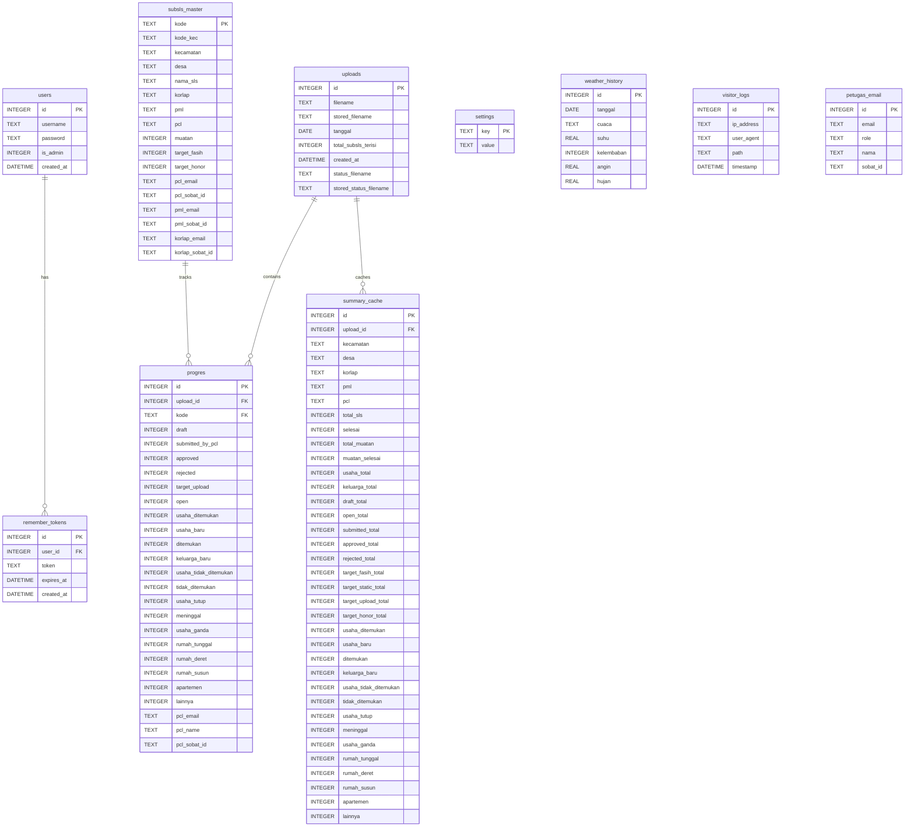

# Visualisasi Skema Database (Per-Survei)

Berikut adalah visualisasi hubungan antar tabel (Entity Relationship Diagram) yang ada di dalam setiap database survei yang terisolasi.

---

### Deskripsi Relasi & Isolasi
* **Relasi Unggahan (`uploads`)**: Setiap baris unggahan mengikat banyak detail perkembangan wilayah (`progres`) dan data komputasi agregat (`summary_cache`).
* **Relasi Wilayah (`subsls_master`)**: Kunci wilayah (`kode` SLS) terhubung dengan entri progres harian untuk validasi status dan nama petugas pencacah di lapangan.
* **Keamanan Akun (`users`)**: Mengelola data admin dan token sesi masuk (`remember_tokens`).
* **Isolasi Penuh**: Skema di atas di-deploy secara identik pada file `.db` terpisah, sehingga tidak ada kontaminasi ID unggahan atau riwayat log antara SE2026, Sakernas Pemutakhiran, dan Sakernas Pendataan.
