# BUKU PANDUAN PENGGUNAAN SISTEM
# DASHBOARD MONITORING SENSUS EKONOMI 2026 (SE2026)
### BADAN PUSAT STATISTIK KABUPATEN PENAJAM PASER UTARA

**Alamat Portal:** [https://monitoring.bpsppu.com/](https://monitoring.bpsppu.com/)  
**Pengembang:** Tim IPDS-DLS & Subbagian Umum BPS Kabupaten Penajam Paser Utara  
**Versi Sistem:** 1.0.0 (Edisi September 2026)  
**Klasifikasi Dokumen:** Buku Pedoman Operasional & Teknis

---

## RINGKASAN EKSEKUTIF

Pelaksanaan lapangan **Sensus Ekonomi 2026 (SE2026)** di Kabupaten Penajam Paser Utara (PPU) dihadapkan pada karakteristik wilayah geografis yang luas, medan berbukit, keterbatasan anggaran transportasi dinas, serta keterbatasan kuota akun pada dashboard pusat BPS (*FASIH*). Untuk memastikan seluruh dokumen terkumpul dengan akurasi tinggi dan tepat waktu sebelum batas akhir nasional, BPS Kabupaten Penajam Paser Utara mengembangkan inovasi **Dashboard Monitoring SE2026**.

Dashboard ini mengubah paradigma supervisi konvensional berbasis pemeriksaan acak (*random checking*) yang boros anggaran menjadi **Pengawasan Tepat Sasaran (*Targeted Supervision*)**. Melalui visualisasi data real-time, sistem deteksi dini (*Early Warning System*), pemetaan spasial GIS, audit kualitas data otomatis, serta integrasi asisten kecerdasan buatan (**Pananyo Taka AI**), pimpinan dan seluruh tim pengawas lapangan dapat mengidentifikasi kendala sejak dini dan mengambil tindakan korektif secara presisi.

Buku panduan ini disusun sebagai rujukan resmi bagi seluruh pegawai BPS PPU, Koordinator Lapangan (Korlap), Pengawas Lapangan (PML), Petugas Pencacah Lapangan (PCL), dan Administrator Sistem dalam memanfaatkan seluruh fitur dashboard secara optimal.

---

## DAFTAR ISI

1. **BAB I: PENDAHULUAN & ARSITEKTUR SISTEM**
   - 1.1 Latar Belakang & Urgensi Sistem
   - 1.2 Landasan Target Milestone SE2026
   - 1.3 Alur Integrasi & Pemrosesan Data
   - 1.4 Arsitektur Perangkat Lunak & Keamanan
2. **BAB II: TATA KELOLA AKUN & HAK AKSES PENGGUNA**
   - 2.1 Matriks Peran Pengguna (*User Roles*)
   - 2.2 Panduan Masuk Sistem (*Login*) & Sesi Aman
3. **BAB III: PANDUAN PENGOPERASIAN MODUL PUBLIK & ANALITIK**
   - 3.1 Peringatan Dini Kinerja Petugas (*Modal Popup*)
   - 3.2 Beranda Utama (*Overview Dashboard*)
   - 3.3 Modul Spasial GIS: Peta Progres & Titik Uji Petik
   - 3.4 Asisten Kecerdasan Buatan "Pananyo Taka AI"
   - 3.5 Navigasi Hirarki Pengawasan (Kecamatan, SubSLS, Korlap, PML, PCL)
   - 3.6 Analisis Kinerja, Tren Harian, & Papan Peringkat (*Leaderboard*)
   - 3.7 Sistem Peringatan Dini (*Early Warning System*)
   - 3.8 Audit Kualitas Data & Deteksi Anomali
   - 3.9 Pusat Ekspor Data Terpadu (Excel, CSV, PDF)
   - 3.10 Modul Pusat Bantuan & FAQ
4. **BAB IV: PANDUAN MODUL ADMINISTRASI & MANAJEMEN SISTEM**
   - 4.1 Hub Menu Administrasi
   - 4.2 Prosedur Unggah Data FASIH & Validasi Excel
   - 4.3 Pengelolaan Master Data Wilayah & Beban Tugas
   - 4.4 Konfigurasi Sistem, Target, & Visibilitas Menu
   - 4.5 Manajemen Akun Pengguna & Hak Akses
   - 4.6 Broadcast & Notifikasi Email Petugas
   - 4.7 Integrasi WhatsApp Gateway & Bot Notifikasi Otomatis
   - 4.8 Sinkronisasi Google Spreadsheet Anomali 2-Arah
   - 4.9 Pencadangan & Pemulihan Database SQLite
5. **BAB V: STANDAR OPERASIONAL PROSEDUR (SOP) INTERVENSI LAPANGAN**
   - 5.1 SOP-01: Penanganan Petugas Stagnan & Berisiko Terlambat
   - 5.2 SOP-02: Supervisi Lapangan & Uji Petik Berbasis Spasial
   - 5.3 SOP-03: Rekonsiliasi Temuan Anomali Kuesioner
   - 5.4 SOP-04: Prosedur Pembaruan Data Harian oleh Admin
6. **BAB VI: PENYELESAIAN KENDALA (TROUBLESHOOTING) & FAQ**

---

# BAB I: PENDAHULUAN & ARSITEKTUR SISTEM

### 1.1 Latar Belakang & Urgensi Sistem
Kabupaten Penajam Paser Utara memiliki 4 kecamatan yang membentang dari pesisir hingga pedalaman: **Penajam, Waru, Babulu, dan Sepaku** (yang berbatasan langsung dengan kawasan Ibu Kota Nusantara / IKN). Luasnya cakupan wilayah dan keberagaman karakteristik usaha menuntut pemantauan intensif. Namun demikian, pelaksanaan sensus menghadapi tantangan nyata:
1. **Keterbatasan Anggaran Perjalanan Dinas Pengawasan:** Pemeriksaan lapangan secara sporadis atau acak (*random inspection*) membutuhkan biaya operasional transportasi yang sangat tinggi dan sering kali tidak efektif menjangkau petugas yang bermasalah.
2. **Keterbatasan Akun Dashboard Pusat (FASIH):** Akses monitoring aplikasi pusat memiliki lisensi terbatas sehingga staf fungsional dan pendamping lapangan di daerah tidak dapat memantau progres secara mandiri setiap saat.
3. **Ketergantungan Jalur VPN:** Pengaksesan sistem fasih internal membutuhkan jalur VPN kantor yang kerap mengalami kendala latensi pada jaringan lapangan.

Dashboard Monitoring SE2026 PPU hadir sebagai solusi mandiri berbasis web yang ringan, cepat, adaptif pada perangkat mobile (*responsive smartphone*), dan dapat diakses publik/internal tanpa koneksi VPN rumit.

### 1.2 Landasan Target Milestone SE2026
Sistem secara otomatis mengukur laju akumulasi pengumpulan dokumen terhadap 3 batas tonggak capaian (*national milestones*):
* **Milestone 1 (30 Juni 2026):** Akumulasi dokumen minimal mencapai **25%** dari total target beban kabupaten.
* **Milestone 2 (15 Juli 2026):** Akumulasi dokumen minimal mencapai **40%** dari total target beban kabupaten.
* **Milestone 3 (31 Agustus 2026):** Penyelesaian pencacahan **100%** seluruh dokumen usaha di Kabupaten PPU.

### 1.3 Alur Integrasi & Pemrosesan Data
```
[File FASIH-SM (.xlsx/.csv)] 
       │ 
       ▼
[Admin Upload & Schema Validator] 
       │ 
       ├─► [Kalkulasi Delta Harian & Histori SQLite]
       ├─► [Agregasi Multi-Level: Kec ➔ Korlap ➔ PML ➔ PCL ➔ SubSLS]
       ├─► [Engine Peringatan Dini (EWS) & Laju Aman Tepat Waktu]
       ├─► [Sinkronisasi Google Spreadsheet Anomali (2-Way Webhook)]
       └─► [Bot WhatsApp Gateway Auto-Broadcast Notifikasi Grup]
```

---

# BAB II: TATA KELOLA AKUN & HAK AKSES PENGGUNA

### 2.1 Matriks Peran Pengguna (*User Roles*)

| Peran (*Role*) | Akses Modul Publik | Akses Pananyo Taka AI | Hak Akses Ekspor Data | Hak Akses Administrasi & Upload |
| :--- | :---: | :---: | :---: | :---: |
| **Publik / Staf BPS** | ✅ Penuh | ✅ Bebas Tanya Data | ✅ Ekspor Standar | ❌ Tidak Ada |
| **PCL (Pencacah)** | ✅ Penuh | ✅ Audit Kinerja Mandiri | ✅ Ekspor SubSLS Binaan | ❌ Tidak Ada |
| **PML (Pengawas)** | ✅ Penuh | ✅ Audit Tim PCL Binaan | ✅ Ekspor Wilayah Tugas | ❌ Tidak Ada |
| **Korlap** | ✅ Penuh | ✅ Monitoring Tim Kecamatan | ✅ Ekspor Agregat Tim | ⚠️ Sesuai Izin Khusus |
| **Administrator** | ✅ Penuh | ✅ Akses Mode Penuh | ✅ Ekspor Lengkap | ✅ **Akses Menu Admin Penuh** |

### 2.2 Panduan Masuk Sistem (*Login*) & Sesi Aman
Untuk mengakses menu administrasi, pengunggahan berkas, konfigurasi sistem, dan manajemen pengguna, petugas pengelola wajib melakukan autentikasi melalui menu **Login**.

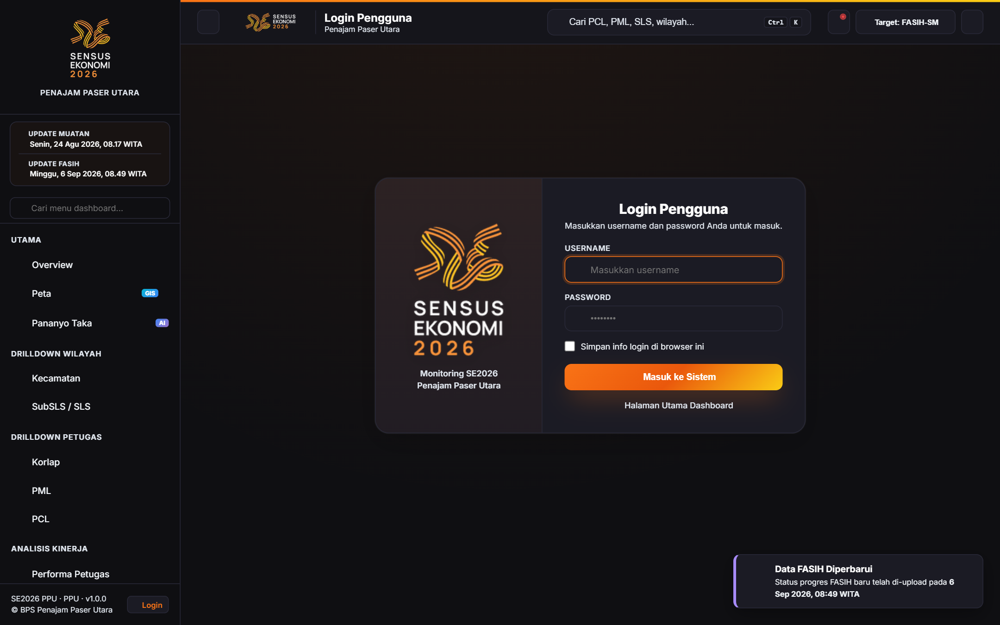
*Gambar 2.1: Tampilan Form Autentikasi Pengguna & Pengawas dengan Proteksi CSRF*

#### Langkah-langkah Login:
1. Akses alamat [https://monitoring.bpsppu.com/login](https://monitoring.bpsppu.com/login) melalui browser (Chrome, Edge, Safari, atau Firefox).
2. Masukkan **Username** (contoh: `admin` atau username yang telah didaftarkan).
3. Masukkan **Password**. Klik ikon mata pada sisi kanan kolom untuk memeriksa kebenaran pengetikan kata sandi.
4. Beri centang pada opsi **"Simpan info login di browser ini"** (*Remember Me*) jika menggunakan perangkat kerja pribadi agar sesi tetap aktif selama 30 hari.
5. Klik tombol **Masuk ke Sistem**.
6. Sistem memverifikasi kredensial menggunakan enkripsi *SHA-256* dan token *CSRF*. Setelah berhasil, Administrator langsung diarahkan ke halaman `/admin`.

---

# BAB III: PANDUAN PENGOPERASIAN MODUL PUBLIK & ANALITIK

### 3.1 Peringatan Dini Kinerja Petugas (*Early Warning Modal Popup*)
Setiap kali pengguna membuka halaman beranda, sistem secara otomatis mengevaluasi kondisi data unggahan terakhir dan menampilkan ringkasan kritis jika terdeteksi anomali kinerja lapangan.

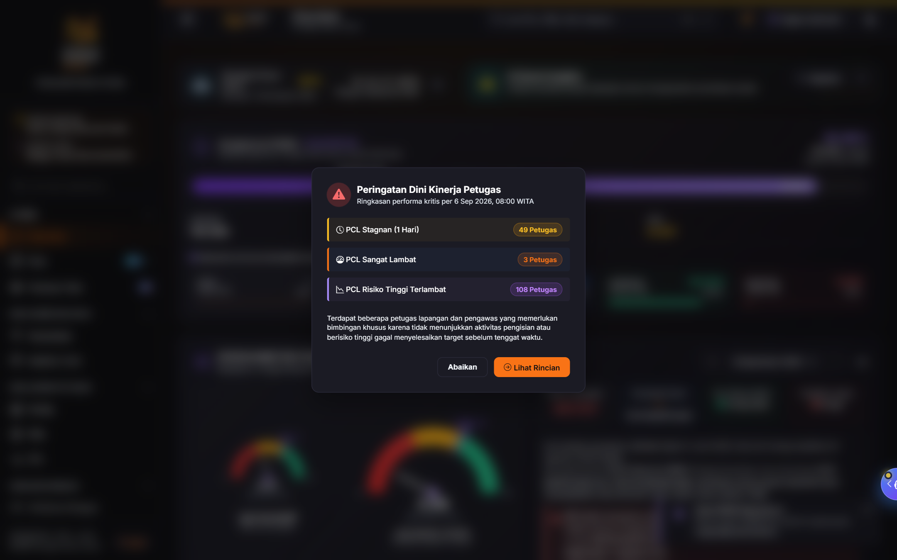
*Gambar 3.1: Dialog Peringatan Dini Otomatis saat Akses Dashboard Dibuka*

#### Unsur Informasi pada Dialog:
* **PCL Stagnan (1 Hari):** Jumlah petugas yang tidak menghasilkan dokumen baru sama sekali pada hari pengunggahan terakhir.
* **PCL Sangat Lambat:** Jumlah petugas yang memiliki laju rata-rata harian di bawah 5.0 dokumen per hari.
* **PCL Risiko Tinggi Terlambat:** Jumlah petugas yang berdasarkan proyeksi laju berjalan tidak akan mampu menyelesaikan target beban kerja sebelum tanggal tenggat waktu sensus.
* **Aksi:** Tombol **"Lihat Rincian"** akan langsung membawa pengawas ke halaman investigasi detail `/early-warning`, sedangkan tombol **"Abaikan"** menutup dialog dan menyimpan status baca pada peramban.

---

### 3.2 Beranda Utama (*Overview Dashboard*)
Halaman Beranda menyajikan gambaran komprehensif seluruh indikator makro pelaksanaan sensus di Kabupaten Penajam Paser Utara.

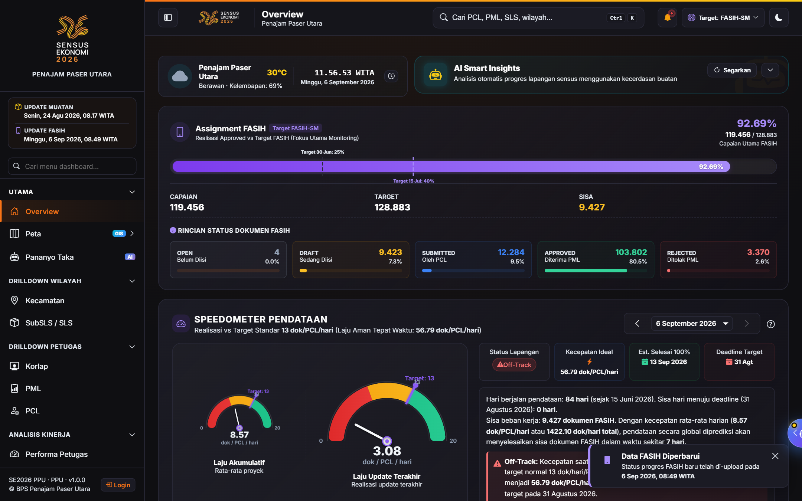
*Gambar 3.2: Overview Bagian Atas - KPI FASIH-SM, Speedometer Pendataan, dan Cuaca*

#### Komponen Utama Bagian Atas:
1. **Widget Cuaca Real-Time:** Menampilkan kondisi cuaca di Kabupaten PPU (suhu rata-rata, kelembapan, kondisi berawan/hujan) serta jam kerja operasional WITA sebagai pertimbangan kendala fisik pencacahan lapangan.
2. **AI Smart Insights:** Kotak ringkasan otomatis yang dihasilkan kecerdasan buatan untuk menginterpretasikan tren dan kendala lapangan terkini tanpa perlu membaca tabel secara manual.
3. **Kartu Assignment FASIH (Target FASIH-SM):**
   - **Persentase Capaian Utama:** Realisasi Approved terhadap total target alokasi dokumen (contoh: **92,69%** atau 119.456 dari 128.883 dokumen).
   - **Garis Tonggak Capaian (*Milestone Track*):** Indikator posisi pencapaian saat ini dibandingkan target 30 Juni (25%) dan target 15 Juli (40%).
   - **Rincian Status Dokumen:**
     - `Open`: Dokumen dialokasikan namun belum disentuh petugas.
     - `Draft`: Dokumen dalam proses pengisian oleh PCL.
     - `Submitted`: Dokumen telah selesai diisi PCL dan menunggu verifikasi/pemeriksaan oleh PML.
     - `Approved`: Dokumen telah diperiksa dan disetujui resmi oleh PML (*fokus utama progres*).
     - `Rejected`: Dokumen dikembalikan PML ke PCL untuk perbaikan isian lapangan.
4. **Speedometer Pendataan Lapangan:**
   - **Standar Produktivitas BPS:** Ditetapkan 13 dokumen per PCL per hari kerja.
   - **Laju Aman Tepat Waktu (*Safe Pace*):** Menghitung secara dinamis kecepatan minimum harian yang wajib dicapai seluruh petugas aktif agar target rampung 100% pada deadline sensus.
   - **Status Lapangan:** Menampilkan label otomatis **On-Track** (hijau) jika laju mencukupi, atau **Off-Track** (merah menyala) jika terdapat defisit kecepatan.
   - **Gauges Dual-Speed:** Mengukur laju akumulatif rata-rata proyek vs laju penambahan pada tanggal update terakhir.

---

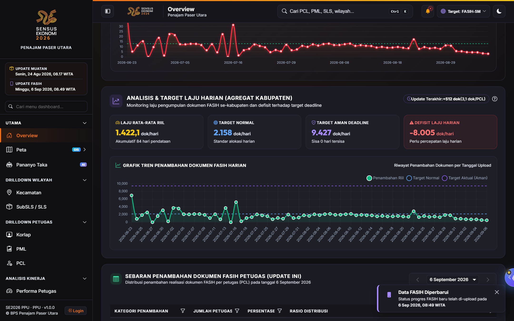
*Gambar 3.3: Overview Bagian Bawah - Analisis Laju Harian, Kurva Tren, dan Sebaran Penambahan Petugas*

#### Komponen Utama Bagian Bawah:
1. **Analisis & Target Laju Harian (Agregat Kabupaten):**
   - `Laju Rata-Rata Riil`: Kecepatan aktual pengumpulan dokumen per hari kalender (contoh: 1.422,1 dok/hari).
   - `Target Normal`: Standar alokasi harian reguler (2.158 dok/hari).
   - `Target Aman Deadline`: Laju yang dibutuhkan untuk menghabiskan sisa beban dalam sisa hari yang tersedia.
   - `Defisit Laju Harian`: Selisih kekurangan output harian yang memerlukan percepatan (*acceleration gap*).
2. **Grafik Tren Penambahan Dokumen FASIH Harian:** Visualisasi kurva fluktuasi harian yang membandingkan penambahan riil terhadap garis ambang batas target. Grafik ini memperlihatkan lonjakan maupun penurunan produktivitas tim dari hari ke hari.
3. **Sebaran Penambahan Dokumen FASIH Petugas:** Tabel distribusi frekuensi penambahan dokumen yang mengelompokkan petugas ke dalam rentang penambahan (0 dokumen, 1-5 dokumen, 6-10 dokumen, dan >10 dokumen).

---

### 3.3 Modul Spasial GIS: Peta Progres & Titik Uji Petik

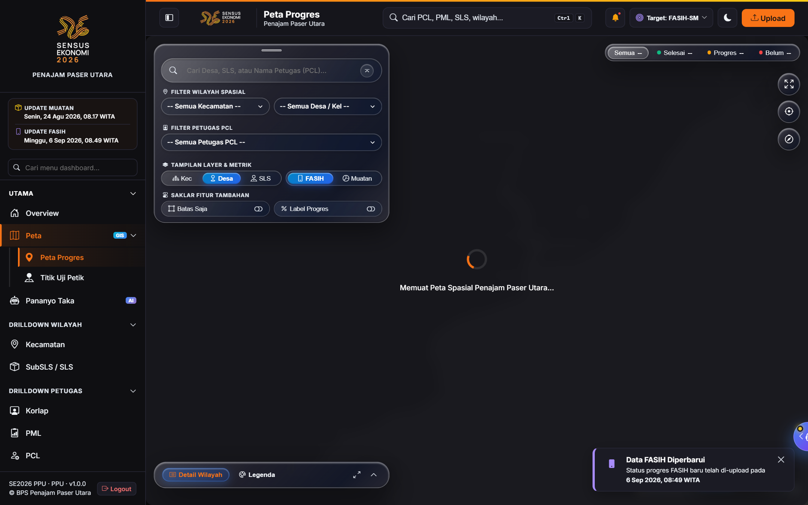
*Gambar 3.4: Peta Spasial Progres Pendataan Berbasis GIS di Kabupaten PPU*

Peta GIS mengintegrasikan data tabular sensus dengan poligon geografis resmi Kabupaten Penajam Paser Utara. Modul ini memungkinkan pimpinan memantau kondisi lapangan secara spasial tanpa harus membaca tumpukan lembar kerja.

#### Fitur & Navigasi Peta:
* **Filter Spasial Bertingkat:** Pemilihan Kecamatan (Penajam, Waru, Babulu, Sepaku) dan Desa/Kelurahan secara instan.
* **Filter Petugas (PCL):** Menampilkan poligon wilayah tugas yang menjadi beban tanggung jawab petugas pencacah tertentu.
* **Tampilan Layer & Metrik:** Beralih antara agregasi tingkat Kecamatan, Desa, atau tingkat Satuan Lingkungan Setempat (SLS).
* **Saklar % Label Progres:** Mengaktifkan atau menonaktifkan tampilan angka persentase langsung di atas poligon peta.
* **Gradasi Warna Choropleth:**
  - 🟢 **Hijau Tua / Hijau Terang:** Wilayah dengan persentase penyelesaian tinggi (80% - 100%).
  - 🟡 **Kuning / Emas:** Wilayah dalam progres aktif sedang (50% - 79%).
  - 🔴 **Merah / Oranye:** Wilayah tertinggal atau berisiko tinggi yang membutuhkan intervensi mendesak (< 50%).
* **Fitur Interaktif:** Klik pada poligon wilayah untuk memunculkan *popup dialog* berisi informasi jumlah SLS, total beban target, realisasi approved, dan daftar petugas pengawas penanggung jawab.

---

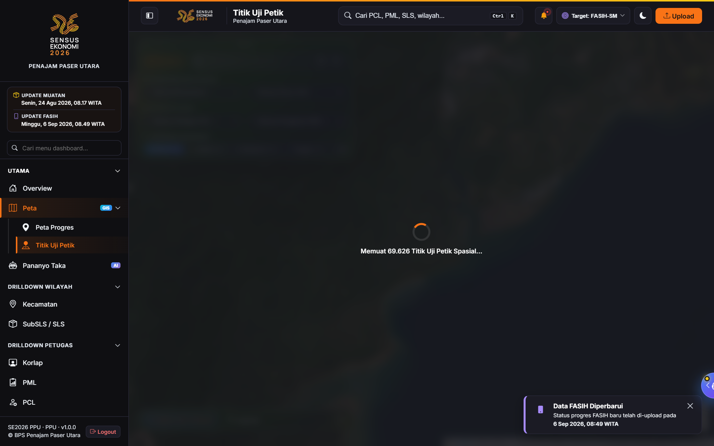
*Gambar 3.5: Peta Sebaran Titik Pengawasan & Uji Petik Spasial*

Modul ini memetakan titik-titik sampel pengawasan lapangan (*ground truth audit*) yang telah dikunjungi oleh pimpinan atau tim supervisi kualitas BPS PPU, guna memastikan tidak ada konsentrasi pengawasan di satu titik saja dan menjamin keterwakilan uji petik di seluruh kecamatan.

---

### 3.4 Asisten Kecerdasan Buatan "Pananyo Taka AI"

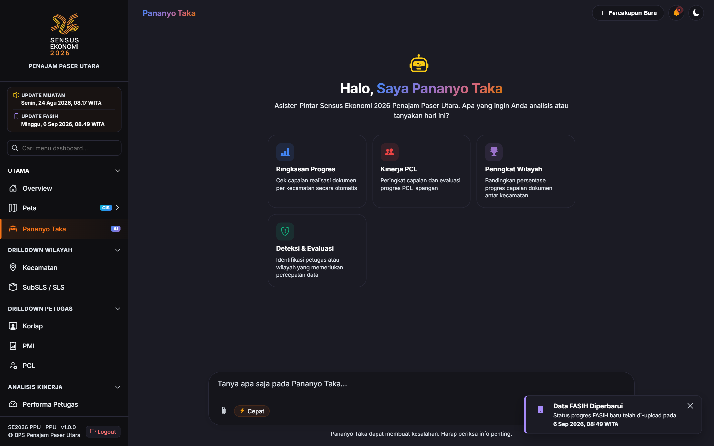
*Gambar 3.6: Antarmuka Chat Pintar Pananyo Taka Berbasis Model Gemini AI*

**Pananyo Taka** (Bahasa Paser yang berarti *"Penanya Kita"*) adalah asisten monitoring AI interaktif yang dirancang khusus untuk membedah data sensus secara cepat melalui percakapan bahasa manusia alami (*natural language query*).

#### Keunggulan Pananyo Taka:
1. **Query Data Instan Tanpa Rumus:** Pengguna tidak perlu menulis query SQL atau mengutak-atik rumus Excel. Cukup ketik pertanyaan seperti biasa.
2. **Kategori Prompt Bantuan:**
   - `Ringkasan Progres`: Menganalisis capaian realisasi dokumen per kecamatan secara otomatis.
   - `Kinerja PCL`: Menilai peringkat capaian dan evaluasi petugas lapangan.
   - `Peringkat Wilayah`: Membandingkan laju pencapaian antar kecamatan.
   - `Deteksi & Evaluasi`: Mengidentifikasi petugas atau wilayah yang memerlukan percepatan.
3. **Eksplorasi Tabel AI (`/agent/table`):** Jawaban yang memerlukan rincian data tabular akan dilengkapi tautan tombol untuk membuka lembar data lengkap yang dapat diekspor langsung ke berkas Excel (.xlsx).

---

### 3.5 Navigasi Hirarki Pengawasan Lapangan

Sistem monitoring menerapkan prinsip *drill-down hierarchical reporting* yang memungkinkan audit dari tingkat paling makro hingga tingkat paling mikro:

```
Kecamatan (4 Wilayah)
   └── Koordinator Lapangan (Korlap)
          └── Pengawas Lapangan (PML)
                 └── Petugas Pencacah Lapangan (PCL)
                        └── Satuan Lingkungan Setempat (SubSLS/SLS)
```

#### A. Rekapitulasi Wilayah Kecamatan (`/kecamatan`)
Menyajikan tabel perbandingan 4 kecamatan di Kabupaten PPU yang mencakup total target FASIH, dokumen Approved, Submitted, Draft, sisa dokumen, persentase capaian, serta rasio penyelesaian SLS.

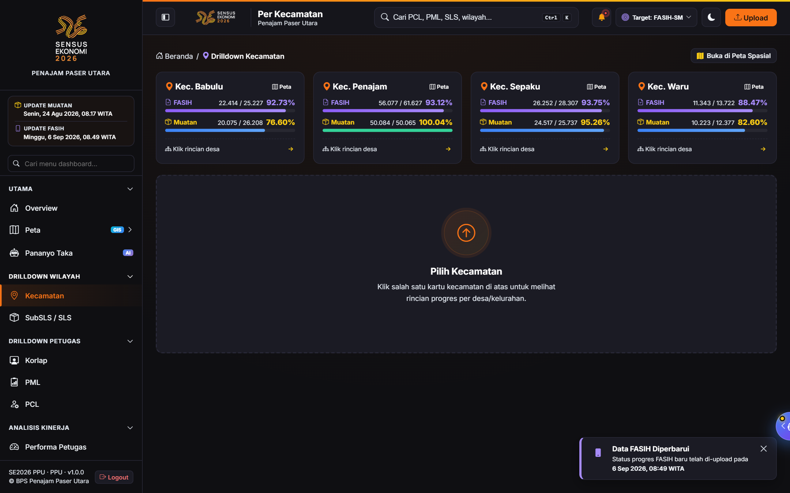
*Gambar 3.7: Rekapitulasi Progres Agregat 4 Kecamatan di PPU*

---

#### B. Monitoring Tingkat Satuan Lingkungan Setempat (`/subsls`)
Menyajikan daftar ribuan SLS/SubSLS dengan filter lengkap (Kecamatan, Desa, Korlap, PML, PCL, dan Status Pengerjaan). Halaman ini sangat krusial untuk menemukan SLS yang berstatus **"Belum Mulai"** atau **"Sedang Didata"** yang terabaikan.

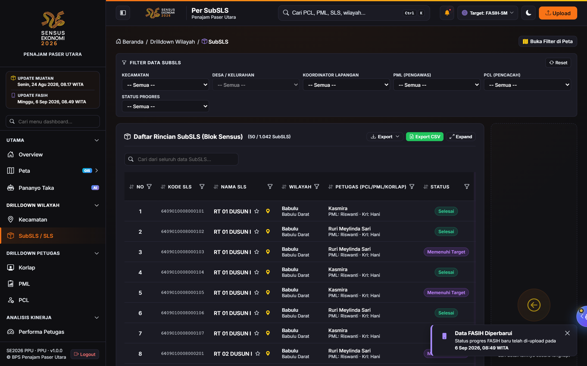
*Gambar 3.8: Daftar Detail Progres per Satuan Lingkungan Setempat (SubSLS)*

---

#### C. Monitoring Koordinator Lapangan (`/korlap`)
Memantau beban kerja dan pencapaian tim yang berada di bawah koordinasi masing-masing Korlap. Memudahkan penataan ulang sumber daya jika terdapat Korlap yang mengalami hambatan geografis berat.

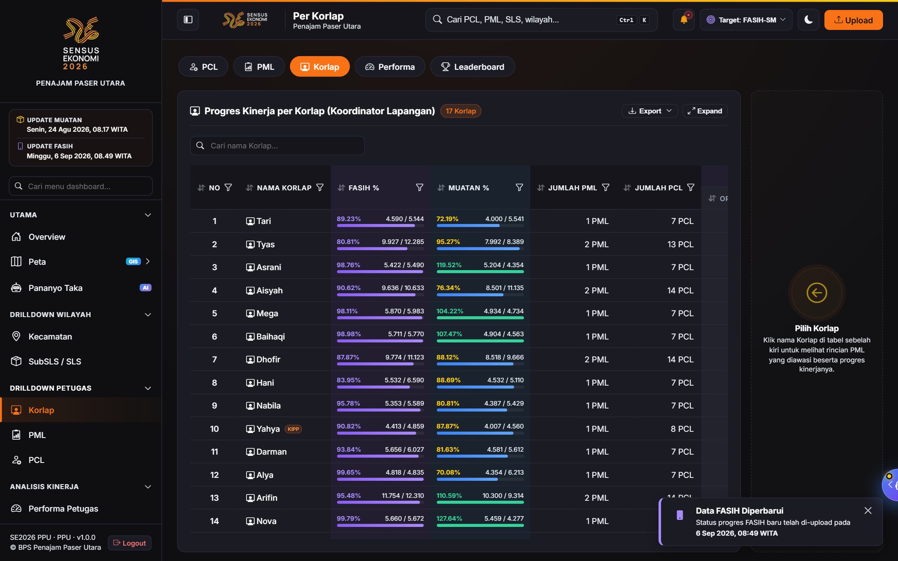
*Gambar 3.9: Evaluasi Kinerja Koordinator Lapangan (Korlap)*

---

#### D. Monitoring Pengawas Lapangan PML (`/pml`)
Memantau efektivitas pengawasan oleh PML. Menampilkan metrik krusial: jumlah PCL binaan, total dokumen yang sudah disetujui (`Approved`), dokumen yang menunggu verifikasi PML (`Submitted`), dan rasio approval pengawas.

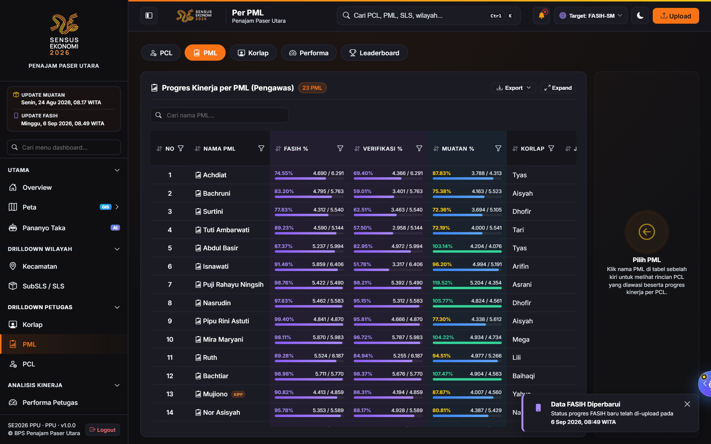
*Gambar 3.10: Monitoring Pengawas Lapangan (PML) & Rasio Verifikasi Dokumen*

---

#### E. Monitoring Petugas Pencacah Lapangan PCL (`/pcl`)
Menyajikan daftar seluruh petugas pencacah lapangan (100+ PCL) lengkap dengan target kuota, total dokumen terselesaikan, persentase kemajuan individu, dan status aktivitas harian.

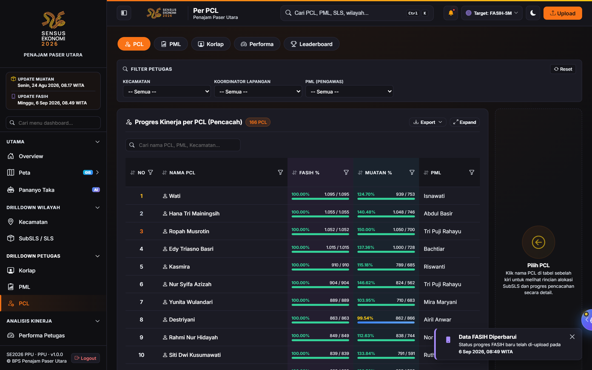
*Gambar 3.11: Rincian Kinerja Petugas Pencacah Lapangan (PCL)*

---

### 3.6 Analisis Kinerja, Tren Harian, & Papan Peringkat

#### A. Evaluasi Matriks Performa Petugas (`/performa`)
Membandingkan produktivitas harian petugas terhadap standar target operasional. Menampilkan deviasi kecepatan pencacahan untuk mendeteksi dini petugas yang mulai kelelahan atau menghadapi resistensi responden.

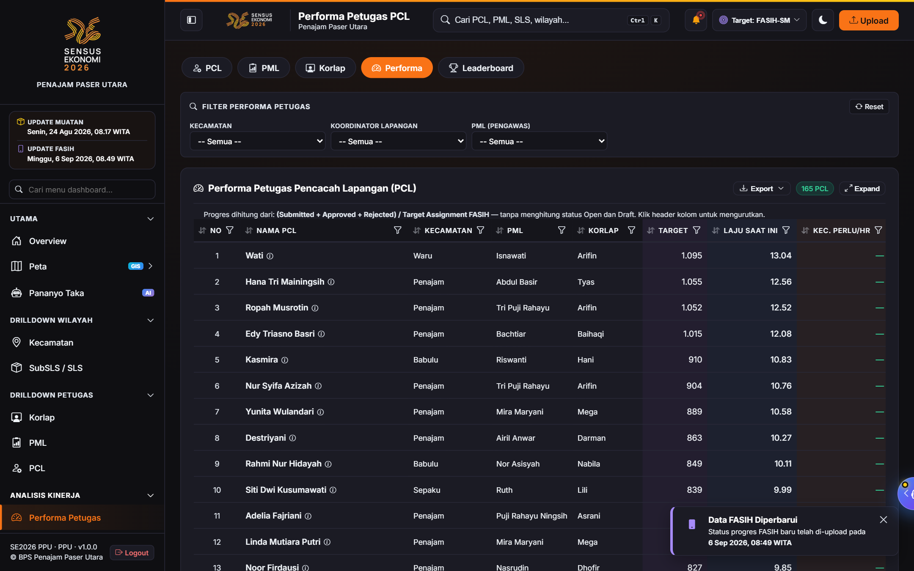
*Gambar 3.12: Evaluasi Matriks Produktivitas & Laju Harian Petugas*

---

#### B. Tren Progres Harian & S-Curve (`/harian`)
Menyajikan kurva akumulasi kumulatif (*S-Curve*) dari awal kegiatan hingga saat ini. Grafik ini memperlihatkan apakah laju percepatan sensus berada di atas atau di bawah lintasan kurva rencana nasional.

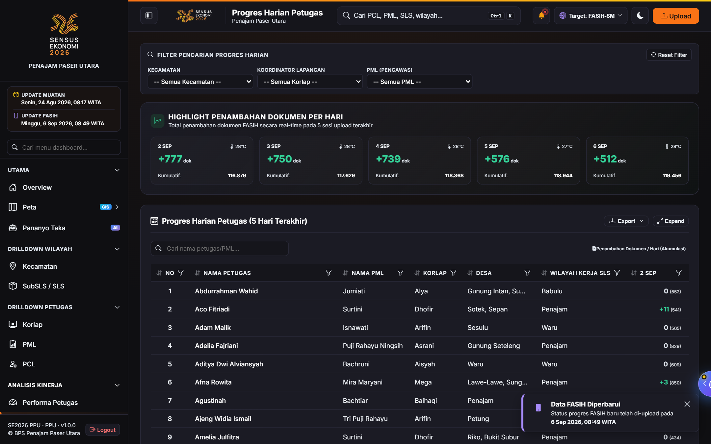
*Gambar 3.13: Tren Harian Penambahan Dokumen & Kurva S Akumulatif*

---

#### C. Papan Peringkat Kinerja Terbaik / Leaderboard (`/leaderboard`)
Memberikan apresiasi dan rekognisi transparan kepada PCL dan PML dengan pencapaian tertinggi, kecepatan verifikasi tercepat, dan rasio kualitas dokumen terbaik di Kabupaten Penajam Paser Utara.

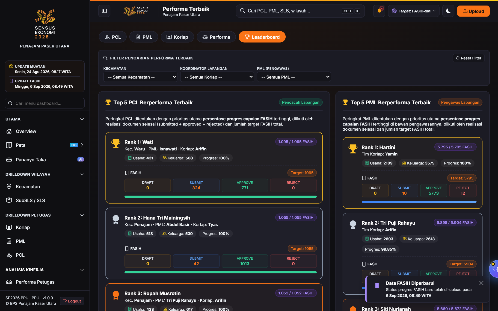
*Gambar 3.14: Papan Peringkat Petugas Kinerja Terbaik (Leaderboard)*

---

#### D. Daftar Petugas Prioritas Pembinaan / Performa Terendah (`/performa-terendah`)
Menyaring daftar petugas yang memiliki persentase capaian paling rendah atau deviasi negatif paling tinggi. Halaman ini menjadi basis utama Korlap dan Koordinator Wilayah untuk mengagendakan kunjungan pendampingan (*coaching*).

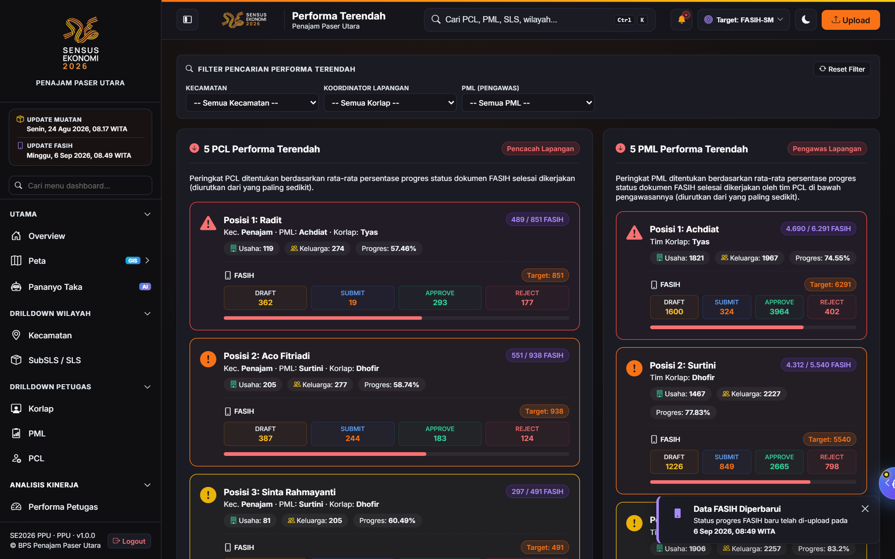
*Gambar 3.15: Daftar Petugas Kritis Prioritas Pendampingan Khusus*

---

### 3.7 Sistem Peringatan Dini (*Early Warning System*) (`/early-warning`)

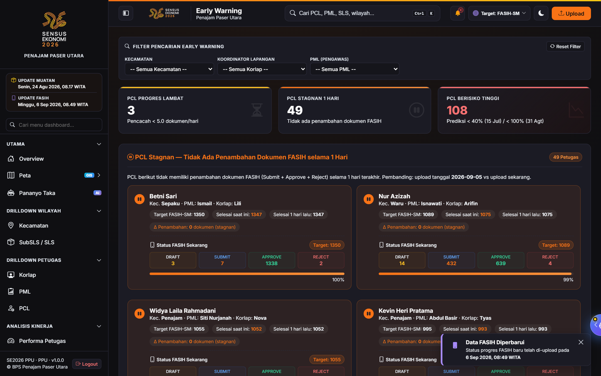
*Gambar 3.16: Dasbor Investigasi Sistem Peringatan Dini (EWS)*

Modul EWS adalah inti dari inovasi *Targeted Supervision*. Sistem secara algoritmis mengelompokkan petugas ke dalam 3 tab kategori kritis:

1. **PCL Progres Lambat:** Petugas dengan produktivitas kurang dari **5,0 dokumen per hari**, jauh di bawah standar beban kerja minimal.
2. **PCL Stagnan 1 Hari:** Petugas yang pada unggahan data harian terakhir memiliki penambahan dokumen sama dengan **0** ($\Delta = 0$).
3. **PCL Berisiko Tinggi:** Petugas yang berdasarkan proyeksi matematis laju saat ini diprediksi tidak akan mencapai target milestone terdekat (< 40% pada 15 Juli atau < 100% pada 31 Agustus).

Setiap kartu petugas pada halaman ini menampilkan nama PCL, nomor kontak, kecamatan, nama PML, nama Korlap, target dokumen, capaian riil, serta rincian dokumen (Draft, Submitted, Approved, Rejected). Pengawas dapat langsung menghubungi petugas terkait untuk mengonfirmasi kendala fisik di lapangan.

---

### 3.8 Audit Kualitas Data & Deteksi Anomali (`/deteksi-anomali`)

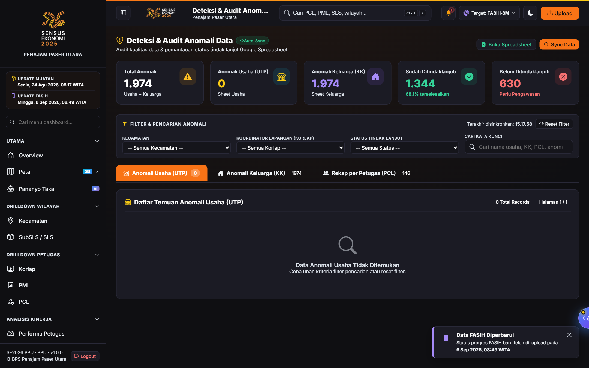
*Gambar 3.17: Dasbor Audit & Deteksi Anomali Kualitas Data Sensus*

Keberhasilan sensus bukan hanya tentang kecepatan kuantitas, melainkan juga integritas kualitas data. Modul ini terhubung secara langsung (*Live Sync*) dengan basis data kendali mutu Google Spreadsheet BPS PPU.

#### Fungsi Utama Modul Anomali:
* **Indikator Temuan:** Menghitung total temuan anomali, klasifikasi anomali Usaha (UTP), anomali Keluarga (KK), jumlah kasus yang sudah diselesaikan, dan kasus yang masih tertunda (*pending*).
* **Pencarian & Filter Cepat:** Menyaring data anomali berdasarkan kecamatan, koordinator lapangan, status penyelesaian (Sudah/Belum), serta pencarian kata kunci nama usaha atau nama KK.
* **Rekapitulasi per Petugas (PCL):** Mengidentifikasi petugas mana yang paling sering menghasilkan dokumen anomali agar PML dapat melakukan pembinaan teknis pengisian kuesioner.

---

### 3.9 Pusat Ekspor Data Terpadu (`/export`)

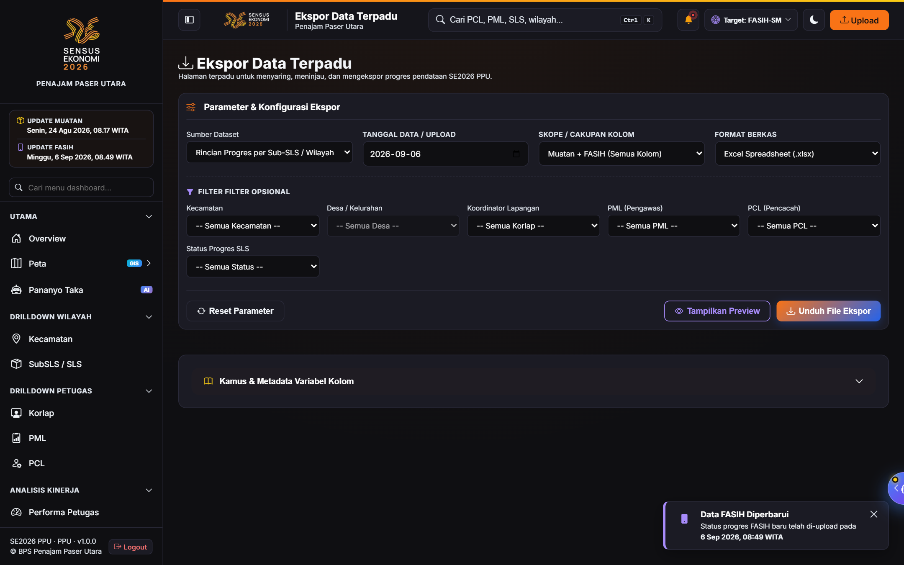
*Gambar 3.18: Antarmuka Ekspor Data Terpadu Multi-Format (Excel, CSV, PDF)*

Halaman ini memungkinkan seluruh staf dan pimpinan mengunduh laporan resmi berkala untuk keperluan rapat koordinasi, arsip dinas, maupun pelaporan pimpinan.

#### Opsi Konfigurasi Ekspor:
* **Sumber Dataset:** Rincian SubSLS, Rekapitulasi PCL, Rekapitulasi PML, Rekapitulasi Korlap, atau Rekapitulasi Kecamatan.
* **Pilihan Tanggal:** Mengunduh data historis pada tanggal unggahan tertentu.
* **Skope Kolom:** Rekapitulasi Lengkap (Muatan + FASIH), Rekapitulasi FASIH saja, atau Rekapitulasi Muatan.
* **Pilihan Format Berkas:**
  - `Excel Spreadsheet (.xlsx)`: Format terstruktur untuk pengolahan lebih lanjut.
  - `Comma-Separated Values (.csv)`: Format universal ringan untuk integrasi sistem lain.
  - `Portable Document Format (.pdf)`: Laporan siap cetak resmi dengan tata letak rapi berstandar laporan dinas.

---

### 3.10 Modul Panduan & Bantuan Interaktif (`/help`)

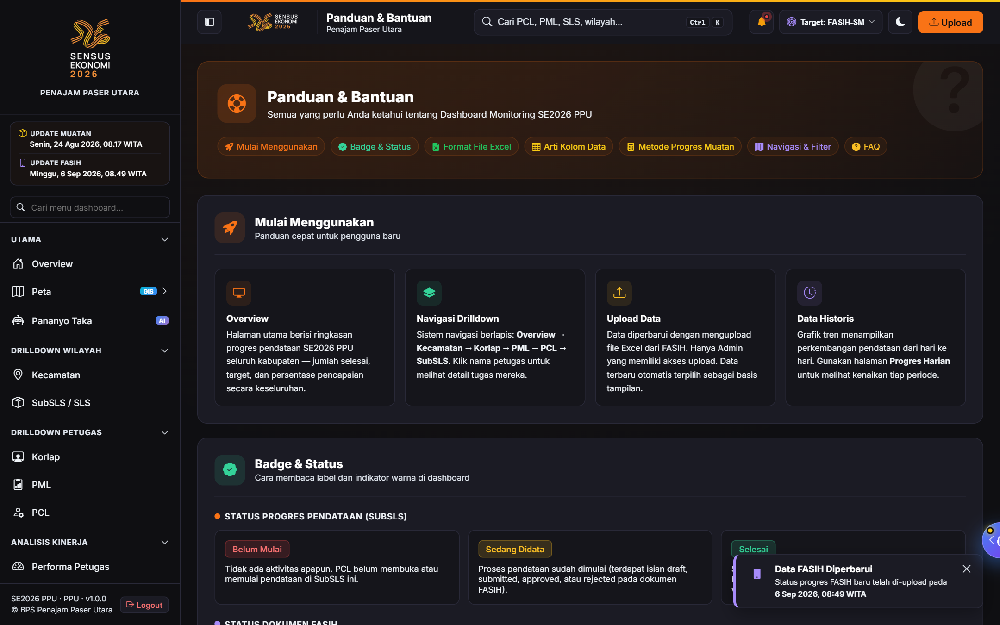
*Gambar 3.19: Pusat Bantuan, Glosarium Istilah SE2026, dan FAQ Operasional*

Menyediakan dokumentasi terintegrasi langsung di aplikasi:
* Petunjuk awal penggunaan (*Getting Started*).
* Arti label, status badge, dan indikator warna di seluruh modul.
* Glosarium definisi istilah kolom data FASIH.
* Tanya Jawab Populer (FAQ).

---

# BAB IV: PANDUAN MODUL ADMINISTRASI & MANAJEMEN SISTEM
*(Khusus Pengguna dengan Hak Akses Administrator)*

### 4.1 Hub Menu Administrasi (`/admin`)

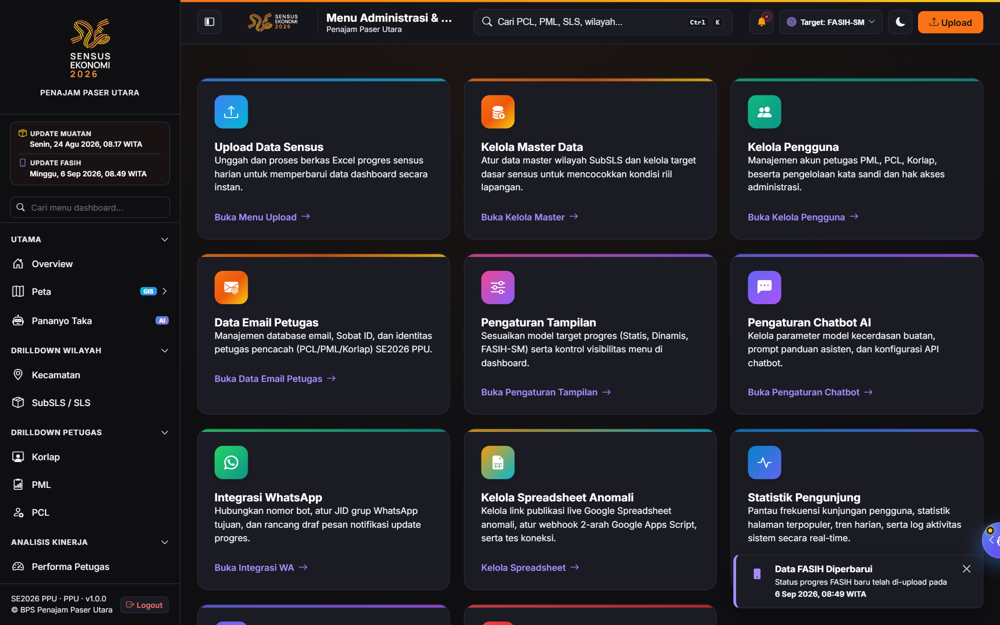
*Gambar 4.1: Hub Navigasi Menu Administrasi & Tata Kelola Sistem*

Halaman `/admin` merupakan panel kendali utama bagi pengelola sistem di BPS Kabupaten Penajam Paser Utara. Panel ini mengelompokkan 9 modul tata kelola:
1. **Upload Data Sensus:** Mengunggah dan memproses file Excel dari portal FASIH.
2. **Kelola Master Data:** Menata alokasi beban, pemetaan SubSLS, dan daftar petugas.
3. **Kelola Pengguna:** Manajemen akun petugas, pimpinan, dan hak akses.
4. **Data Email Petugas:** Pengelolaan alamat email untuk pengiriman rekap progres.
5. **Pengaturan Tampilan & Sistem:** Konfigurasi parameter deadline, bobot target, dan visibilitas menu.
6. **Pengaturan Chatbot AI:** Konfigurasi model Gemini AI dan prompt engineering Pananyo Taka.
7. **Integrasi WhatsApp:** Pengelolaan koneksi bot WhatsApp dan otomasi siaran laporan harian.
8. **Kelola Spreadsheet Anomali:** Pengaturan sinkronisasi 2-arah data kendali mutu.
9. **Backup & Restore Database:** Pencadangan dan pemulihan berkas SQLite.

---

### 4.2 Prosedur Unggah Data FASIH & Validasi Excel (`/admin/upload`)

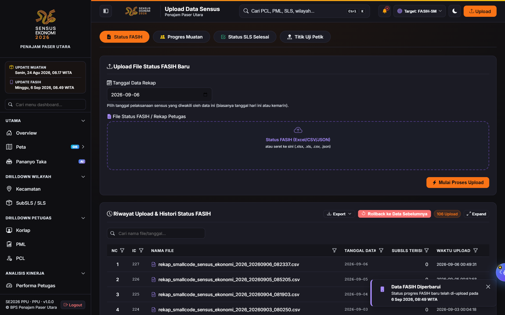
*Gambar 4.2: Formulir Pengunggahan Berkas FASIH & Riwayat Sinkronisasi*

#### Prosedur Unggah Harian:
1. Unduh berkas rekapitulasi status pengerjaan dari portal FASIH Pusat.
2. Akses menu **Upload Data Sensus** (`/admin/upload`).
3. Pilih tab **Status FASIH** (atau tab *Progres Muatan* / *Status SLS Selesai* jika relevan).
4. Tentukan **Tanggal Data Rekap** yang diwakili oleh data tersebut.
5. Seret (*drag & drop*) berkas Excel (.xlsx, .xls, .csv) ke area unggah atau klik untuk memilih file dari komputer.
6. Klik tombol **Mulai Proses Upload**.
7. Sistem secara otomatis:
   - Membaca baris berkas dan memvalidasi kecocokan kolom dengan master data.
   - Menghitung penambahan bersih (*net delta*) harian per petugas.
   - Memperbarui tabel histori database SQLite.
   - Memperbarui *cache* analitik dan memicu pengiriman notifikasi WhatsApp ke grup pengawas.
8. **Fitur Rollback:** Jika file yang diunggah salah tanggal atau rusak, admin dapat mengklik tombol **"Rollback ke Data Sebelumnya"** untuk mengembalikan status data tanpa merusak integritas database.

---

### 4.3 Pengelolaan Master Data Wilayah & Petugas (`/admin/master`)

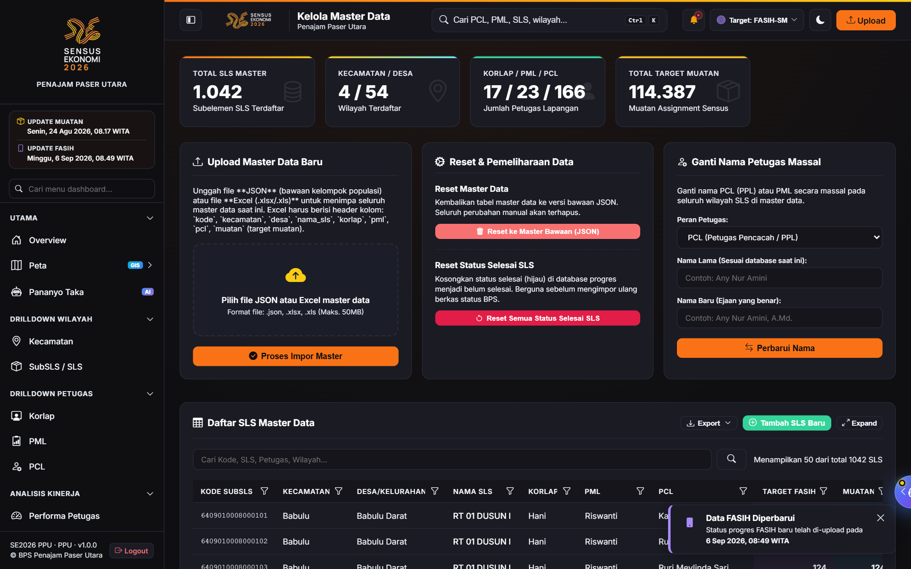
*Gambar 4.3: Pengelolaan Master Data SubSLS, Petugas, dan Alokasi Beban*

Modul ini memuat basis alokasi petugas dan wilayah:
* Mengelola kode wilayah resmi (Kode Kecamatan, Desa/Kelurahan, Kode SLS/SubSLS).
* Mengatur relasi hirarki petugas: Petugas Pencacah (PCL) $\rightarrow$ Pengawas Lapangan (PML) $\rightarrow$ Koordinator Lapangan (Korlap).
* Mengubah target kuota beban prelist jika terjadi pemekaran wilayah atau redistribusi beban kerja lapangan.

---

### 4.4 Pengaturan Konfigurasi Sistem, Target, & Visibilitas (`/admin/settings`)

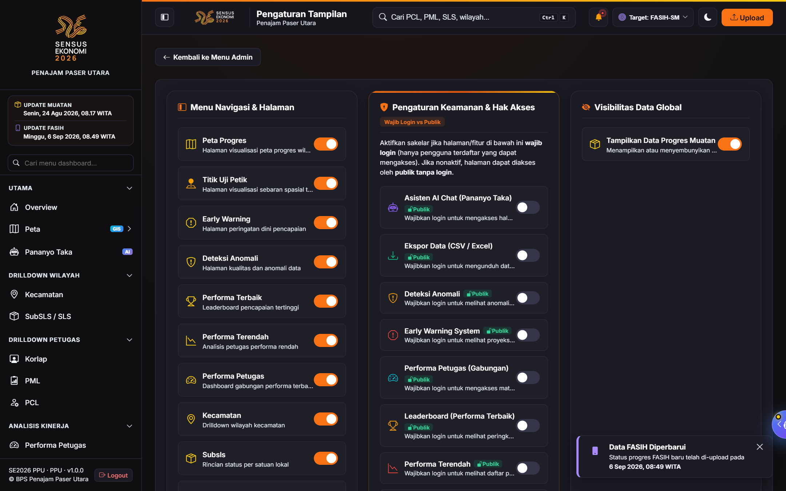
*Gambar 4.4: Konfigurasi Parameter Sistem, Visibilitas Menu, dan Hak Akses*

Admin dapat menyesuaikan sistem secara dinamis tanpa perlu mengubah kode sumber aplikasi:
* **Saklar Visibilitas Menu:** Menonaktifkan atau mengaktifkan menu publik tertentu (Peta Progres, Titik Uji Petik, Early Warning, Deteksi Anomali, Leaderboard, dll.).
* **Kontrol Akses Login vs Publik:** Menetapkan apakah halaman tertentu (seperti Pananyo Taka AI atau Ekspor Data) dapat diakses bebas oleh publik atau wajib login terlebih dahulu.
* **Parameter Target:** Mengubah tanggal batas akhir milestone sensus, rasio target harian, serta jam operasional server.

---

### 4.5 Manajemen Akun Pengguna & Hak Akses (`/admin/users`)

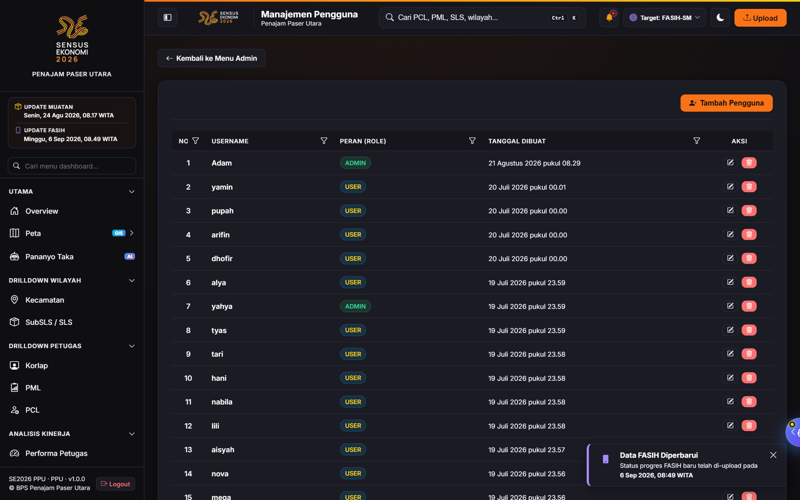
*Gambar 4.5: Manajemen Akun Pengguna, Penetapan Peran, dan Pengaturan Kata Sandi*

* Mendaftarkan pengguna baru dengan peran: `admin`, `korlap`, atau `user`.
* Mengubah kata sandi pengguna (*password reset*) jika petugas lupa kredensial login.
* Menonaktifkan atau menghapus akun petugas yang sudah purnatugas.

---

### 4.6 Broadcast & Notifikasi Email Petugas (`/admin/petugas-email`)

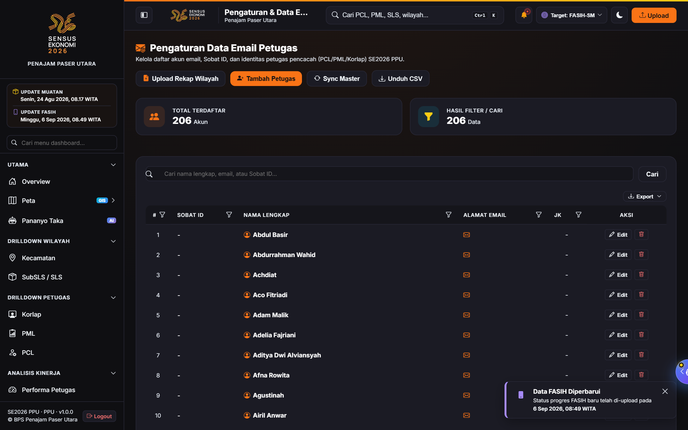
*Gambar 4.6: Manajemen Alamat Email & Pengiriman Laporan Berkala ke Petugas*

Memungkinkan pengiriman laporan rekap progres harian otomatis ke alamat email masing-masing PCL, PML, dan Korlap, sehingga setiap petugas menerima salinan resmi capaian kerja mereka secara privat.

---

### 4.7 Integrasi WhatsApp Gateway & Bot Notifikasi Otomatis (`/admin/whatsapp`)

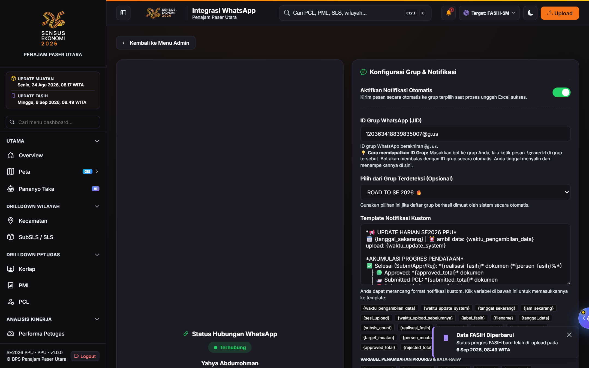
*Gambar 4.7: Panel Integrasi WhatsApp Gateway & Perancangan Draf Pesan Otomatis*

Dashboard dilengkapi integrasi **WhatsApp Gateway (Baileys / Puppeteer WhatsApp-Web)** yang terhubung langsung ke nomor resmi bot BPS PPU:
* **Status Koneksi:** Memantau keterhubungan bot secara *real-time* (dilengkapi watchdog supervisor 24/7).
* **ID Grup WhatsApp (JID):** Menentukan grup tujuan (contoh: grup koordinasi pengawasan `ROAD TO SE 2026 🔥`).
* **Template Notifikasi Kustom:** Merancang draf pesan notifikasi otomatis menggunakan variabel dinamis:
  - `{tanggal_sekarang}`: Tanggal pengiriman pesan.
  - `{realisasi_fasih}`: Total akumulasi dokumen selesai.
  - `{persen_fasih}%`: Persentase progres kabupaten.
  - `{approved_total}`: Jumlah dokumen approved terkini.
  - `{submitted_total}`: Jumlah dokumen menunggu approval.
* **Otomasi Unggah:** Setiap kali admin selesai mengunggah file Excel baru, bot secara otomatis menyiarkan ringkasan progres ke seluruh anggota grup WhatsApp tanpa perlu pengetikan manual.

---

### 4.8 Sinkronisasi Google Spreadsheet Anomali 2-Arah (`/admin/spreadsheet`)

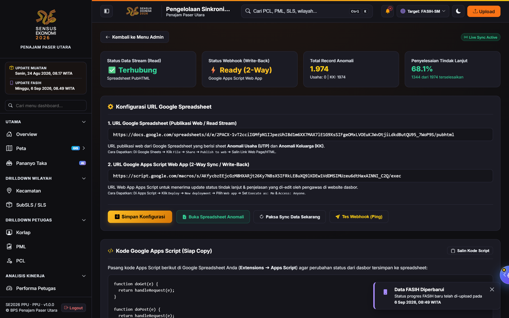
*Gambar 4.8: Konfigurasi Sinkronisasi 2-Arah Google Apps Script & Google Spreadsheet*

Memungkinkan kolaborasi interaktif antara dasbor monitoring dengan lembar kerja Google Spreadsheet yang diisi oleh tim verifikasi mutu:
1. **Read Stream:** Dasbor membaca data temuan anomali dari URL publikasi Google Sheets secara live.
2. **Write-Back (2-Way Sync):** Dilengkapi integrasi webhook Google Apps Script Web App. Saat pengawas memperbarui status tindak lanjut di dashboard, perubahan tersebut langsung dituliskan kembali ke Google Spreadsheet secara instan.
3. **Kode Google Apps Script:** Disediakan kode siap salin (*copy-paste*) untuk dipasang pada Google Spreadsheet target.

---

### 4.9 Pencadangan & Pemulihan Database SQLite (`/admin/settings/backup`)

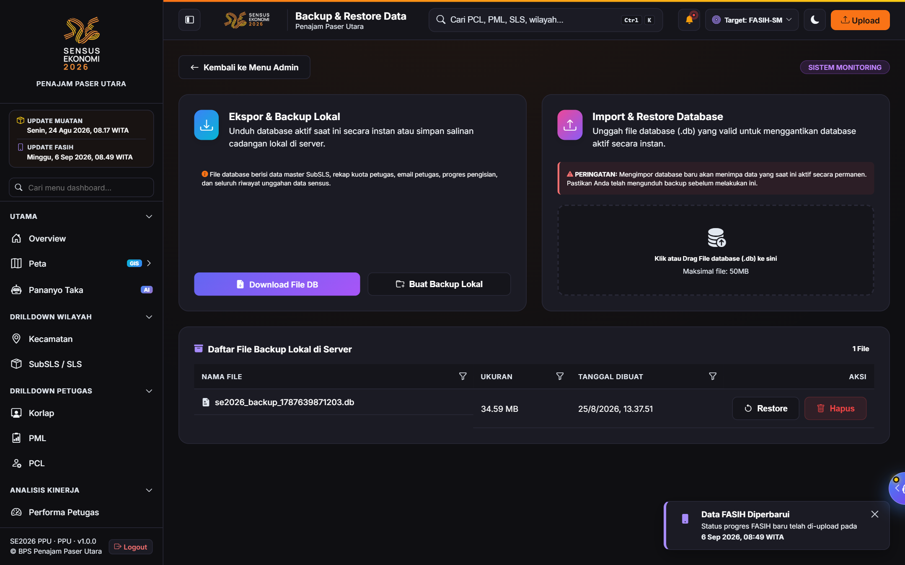
*Gambar 4.9: Fasilitas Ekspor Cadangan & Pemulihan Database Sistem*

Untuk menjamin keberlangsungan operasional dan integritas data terhadap potensi kegagalan server:
* **Ekspor & Download Berkas Database:** Mengunduh snapshot berkas SQLite (`.db`) aktif langsung ke komputer lokal admin hanya dengan sekali klik.
* **Buat Backup Lokal di Server:** Membuat titik pemulihan (*restore point*) cadangan internal di server.
* **Import & Restore Database:** Memulihkan seluruh data dan histori sensus dari berkas cadangan jika terjadi insiden kerusakan sistem.

---

# BAB V: STANDAR OPERASIONAL PROSEDUR (SOP) INTERVENSI LAPANGAN

Untuk memastikan inovasi dashboard berbuah pada peningkatan kinerja nyata, seluruh jajaran pengawasan wajib mematuhi standar operasional berikut:

### 5.1 SOP-01: Penanganan Petugas Terdeteksi Early Warning
1. **Pukul 08.30 WITA Setiap Pagi:** Korlap dan PML wajib membuka modul **Early Warning** (`/early-warning`).
2. **Pemeriksaan Tab Stagnan:** Identifikasi seluruh PCL yang berstatus $\Delta = 0$ dalam 1 hari terakhir.
3. **Kontak Langsung:** PML menghubungi PCL melalui telepon atau WhatsApp untuk menanyakan kendala (apakah terkendala cuaca, sakit, masalah login aplikasi Fasih, atau kendala responden menolak).
4. **Pemberian Asistensi:** Jika petugas mengalami kesulitan teknis kuesioner, PML wajib mendampingi pencacahan pada hari yang sama.
5. **Pencatatan Log:** Korlap mencatat tindak lanjut penanganan pada grup koordinasi.

### 5.2 SOP-02: Pelaksanaan Uji Petik Lapangan Berbasis Peta Spasial
1. **Analisis Poligon Spasial:** Sebelum menjadwalkan perjalanan dinas supervisi, pimpinan dan tim supervisi membuka **Peta Progres** (`/map`).
2. **Penentuan Titik Kritis:** Perjalanan dinas **HANYA** diarahkan ke desa/kelurahan atau SLS yang memiliki warna merah/oranye (< 50%) atau memiliki beban besar yang lambat bergerak.
3. **Efisiensi Anggaran:** Dilarang melakukan supervisi acak ke SLS yang sudah berstatus hijau/selesai. Anggaran transportasi dinas difokuskan 100% pada kantong-kantong wilayah tertinggal.
4. **Pencatatan Titik:** Hasil kunjungan dicatat dan koordinatnya ditambahkan ke modul **Peta Titik Uji Petik** (`/map-ujipetik`).

### 5.3 SOP-03: Rekonsiliasi Temuan Anomali Kuesioner
1. **Pemeriksaan Berkala:** Tim Pengolahan/IPDS memeriksa modul **Deteksi Anomali** (`/deteksi-anomali`).
2. **Konfirmasi ke PML:** Temuan isian janggal (misalnya: omset usaha ekstrem tidak wajar, kode KBLI tidak bersesuaian, titik koordinat usaha berada di tengah laut atau di luar PPU) diteruskan ke PML terkait.
3. **Pencacahan Ulang / Verifikasi:** PML meminta PCL melakukan konfirmasi ulang ke responden usaha terkait.
4. **Penyelesaian Kasus:** Setelah data dikoreksi di aplikasi FASIH pusat, status anomali di dashboard ditandai sebagai **"Sudah Ditindaklanjuti"**.

### 5.4 SOP-04: Prosedur Pembaruan Data Harian oleh Admin
1. **Jadwal Pengunduhan:** Admin mengunduh data rekapitulasi FASIH pusat setiap sore hari pukul 17.00 WITA dan pagi hari pukul 07.30 WITA.
2. **Pengunggahan:** Admin mengunggah berkas melalui `/admin/upload` sesuai tanggal yang bersangkutan.
3. **Verifikasi Notifikasi:** Pastikan pesan ringkasan harian berhasil dikirimkan oleh WhatsApp Bot ke grup koordinasi sensus.

---

# BAB VI: PENYELESAIAN KENDALA (TROUBLESHOOTING) & FAQ

### Q1: Mengapa persentase progres di dashboard belum bertambah padahal PCL sudah mengirimkan dokumen di lapangan?
**Jawaban:**
1. Pastikan dokumen yang dikirimkan PCL di aplikasi FASIH sudah diperiksa dan disetujui (`Approved`) oleh PML. Dokumen yang masih berstatus `Submitted` atau `Draft` belum dihitung ke dalam capaian persentase utama.
2. Dashboard melakukan pembaruan data berkala saat admin mengunggah file rekap FASIH. Periksa kartu **"Update Terakhir"** di pojok kiri atas untuk melihat waktu pengunggahan data terakhir.

### Q2: Mengapa Peta GIS tidak menampilkan warna atau poligon wilayah?
**Jawaban:**
1. Pastikan koneksi internet stabil untuk mengunduh *tiles* peta dan pustaka Leaflet CDN.
2. Jika menggunakan filter, klik tombol **"Reset Filter"** untuk menampilkan kembali seluruh wilayah se-Kabupaten PPU.
3. Muat ulang halaman (*refresh*) dengan menekan kombinasi tombol `Ctrl + F5`.

### Q3: Bagaimana jika saya lupa kata sandi akun?
**Jawaban:**
Hubungi Administrator Sistem di Tim IPDS BPS Kabupaten Penajam Paser Utara untuk melakukan pengaturan ulang kata sandi melalui menu `/admin/users`.

### Q4: Apakah sistem ini dapat diakses melalui ponsel pintar (HP)?
**Jawaban:**
Ya, Dashboard Monitoring SE2026 PPU sepenuhnya dirancang dengan prinsip desain responsif modern (*mobile-friendly*). Seluruh grafik, peta interaktif, dan tabel dapat diakses dengan nyaman melalui peramban ponsel pintar Android maupun iOS.

### Q5: Bagaimana cara menanyakan data spesifik pada Pananyo Taka AI?
**Jawaban:**
Buka menu **Pananyo Taka** (`/agent`), lalu ketikkan pertanyaan seperti berbicara dengan rekan kerja, misalnya:
- *"Tampilkan 5 PCL dengan progres terendah di Kecamatan Babulu"*
- *"Berapa jumlah SLS yang belum mulai didata di Kecamatan Sepaku?"*
- *"Siapa saja pengawas yang memiliki dokumen pending submitted terbanyak?"*
Sistem akan memproses data dan menyajikan jawaban analitis beserta tabel rincian yang siap diunduh ke Excel.

---

**Diterbitkan oleh:**  
**Subbagian Umum & Tim IPDS-DLS**  
**Badan Pusat Statistik Kabupaten Penajam Paser Utara**  
*Jl. Propinsi Km. 08, Kel. Nipah-Nipah, Kec. Penajam, Kabupaten Penajam Paser Utara, Kalimantan Timur 76141*  
*Website: [https://monitoring.bpsppu.com/](https://monitoring.bpsppu.com/) | Email: bps6409@bps.go.id*
