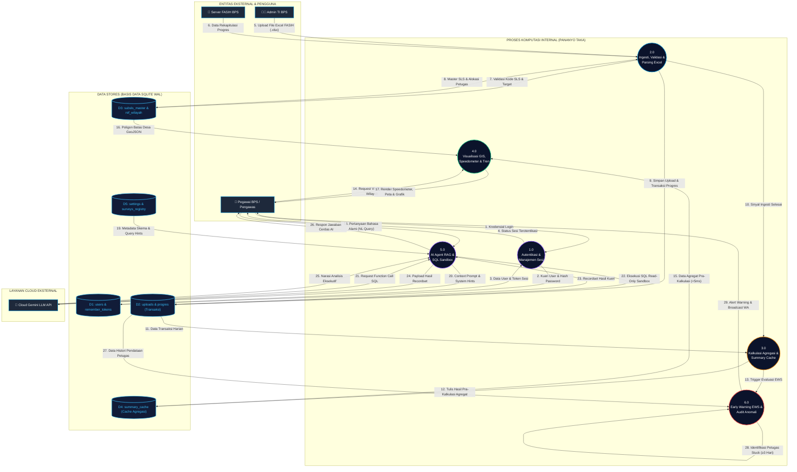
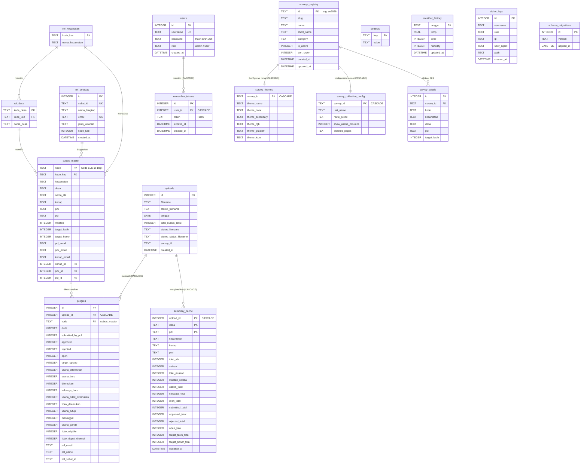
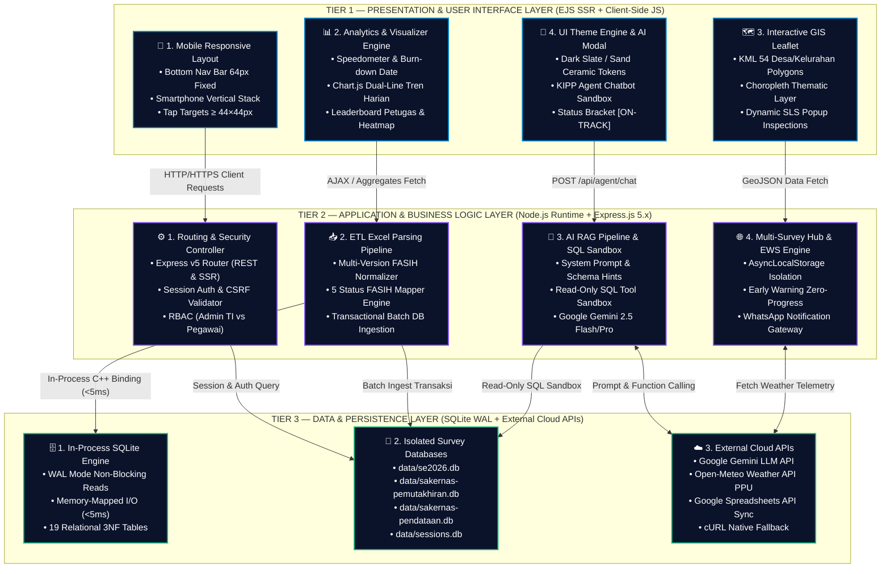
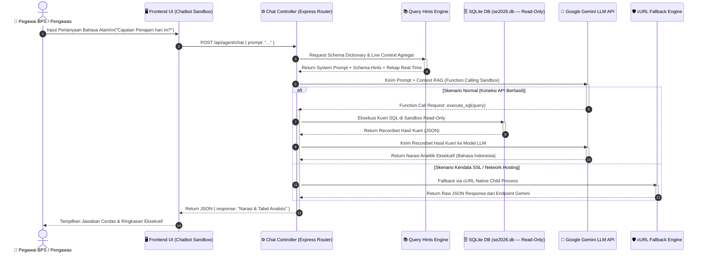
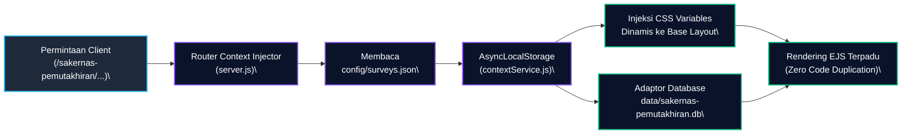

# LAPORAN AKHIR KEGIATAN 2
# PERANCANGAN SISTEM DAN PERANGKAT LUNAK
# *(SYSTEM & SOFTWARE DESIGN — SDLC PHASE 2)*

---

| **Nama Sistem** | Dashboard Pemantauan Lapangan Sensus Ekonomi 2026 (SE2026) & Multi-Survei BPS PPU (*Pananyo Taka*) |
| :--- | :--- |
| **Institusi** | Badan Pusat Statistik (BPS) Kabupaten Penajam Paser Utara |
| **Versi Sistem** | 2.3.0 |
| **Penyusun** | Yahya Abdurrohman, S.Tr.Stat. (NIP: 20020420 202410 1 002) |
| **Mentor / Pengesah** | Ketua Tim IPJKD & DLS BPS Kab. PPU (Ketua Tim IPJKD & DLS BPS Kab. PPU) |
| **Tanggal Dokumen** | 15 Agustus 2026 |
| **Klasifikasi** | Laporan Teknis Resmi — Rekayasa Perangkat Lunak |

---

## LEMBAR PENGESAHAN

Laporan Akhir Kegiatan 2: Perancangan Sistem dan Perangkat Lunak (*System & Software Design — SDLC Phase 2*) ini telah disusun, ditelaah, dan disahkan sebagai dokumen teknis resmi dalam rangka Pelaksanaan Aktualisasi Pelatihan Dasar CPNS BPS Tahun 2026.

| Peran | Nama & Gelar | Jabatan / Unit Kerja | Persetujuan |
| :--- | :--- | :--- | :--- |
| **Penyusun** | Yahya Abdurrohman, S.Tr.Stat. | Pranata Komputer Ahli Pertama / Peserta Latsar CPNS Gol. III | *(Disahkan)* |
| **Mentor / Pengesah** | Ketua Tim IPJKD & DLS BPS Kab. PPU | Ketua Tim IPJKD & DLS BPS Kab. Penajam Paser Utara | *(Disetujui)* |
| **Reviewer Teknis** | Tim Seksi Pengolahan Data & Tim IPJKD & DLS | Seksi Pengolahan & TI BPS Kab. Penajam Paser Utara | *(Terverifikasi)* |

**Penajam, 15 Agustus 2026**

---

## DAFTAR ISI

1. [Ringkasan Eksekutif](#1-ringkasan-eksekutif)
2. [Tujuan & Ruang Lingkup Kegiatan 2](#2-tujuan--ruang-lingkup-kegiatan-2)
3. [Tahapan Kegiatan & Luaran](#3-tahapan-kegiatan--luaran)
   - 3.1. Tahapan 2.1 — Perancangan Skema Relasional Basis Data
   - 3.2. Tahapan 2.2 — Panduan Desain Sistem & UI/UX
   - 3.3. Tahapan 2.3 — Arsitektur Modul AI (RAG Pipeline)
   - 3.4. Tahapan 2.4 — Review Desain Teknis Bersama Tim IT
4. [Analisis Kebutuhan Sistem](#4-analisis-kebutuhan-sistem)
5. [Arsitektur Perangkat Lunak](#5-arsitektur-perangkat-lunak)
6. [Diagram Perancangan Sistem (7 Diagram Teknis)](#6-diagram-perancangan-sistem-7-diagram-teknis)
   - Gambar 6.1 — System Context Diagram (DFD Level 0)
   - Gambar 6.2 — Use Case Diagram
   - Gambar 6.3 — Data Flow Diagram (DFD) Level 1
   - Gambar 6.4 — Entity Relationship Diagram (ERD)
   - Gambar 6.5 — 3-Tier Layered Architecture Diagram
   - Gambar 6.6 — Activity Diagram
   - Gambar 6.7 — Sequence Diagram (AI RAG Pipeline)
7. [Perancangan Basis Data](#7-perancangan-basis-data)
8. [Perancangan Antarmuka Pengguna (UI/UX Design System)](#8-perancangan-antarmuka-pengguna-uiux-design-system)
9. [Arsitektur Modul Fungsional Utama](#9-arsitektur-modul-fungsional-utama)
10. [Aspek Keamanan, Keandalan & Kinerja](#10-aspek-keamanan-keandalan--kinerja)
11. [Rencana Implementasi (Fase 3)](#11-rencana-implementasi-fase-3)
12. [Kesimpulan](#12-kesimpulan)
13. [Lampiran — Daftar Dokumen Pendukung](#13-lampiran--daftar-dokumen-pendukung)

---

## 1. Ringkasan Eksekutif

Kegiatan 2 (Perancangan Sistem dan Perangkat Lunak) merupakan tahap kedua dari siklus pengembangan perangkat lunak (*Software Development Life Cycle* — SDLC) model Waterfall yang diterapkan dalam aktualisasi Pelatihan Dasar CPNS BPS Tahun 2026. Kegiatan ini berpedoman pada hasil Analisis Kebutuhan yang telah disahkan pada Kegiatan 1 (Fase 1).

Pada fase ini, seluruh cetak biru teknis (*technical blueprint*) sistem **Pananyo Taka** — Dashboard Pemantauan Lapangan Sensus Ekonomi 2026 (SE2026) dan Multi-Survei BPS Kabupaten Penajam Paser Utara — berhasil dirancang secara komprehensif, mencakup:

- **7 (tujuh) Diagram Perancangan Sistem** standar rekayasa perangkat lunak (System Context DFD Level 0, Use Case Diagram, DFD Level 1, ERD 19 Tabel, 3-Tier Architecture, Activity Diagram, dan Sequence Diagram AI RAG Pipeline).
- **Panduan Desain Sistem & UI/UX** (*Design System Guide*) dengan standar aksesibilitas WCAG 2.1 AA dan skala tipografi mobile.
- **Spesifikasi Skema Basis Data** relasional 19 tabel SQLite dengan mode Write-Ahead Logging (WAL).
- **Arsitektur Modul AI** berbasis Retrieval-Augmented Generation (RAG) dengan integrasi Google Gemini LLM.
- **Berita Acara Review Desain Teknis** bersama Tim IT Seksi Pengolahan & Tim IPJKD & DLS Data & Tim IPJKD & DLS & Tim IPJKD & DLS BPS PPU.

Seluruh luaran Kegiatan 2 berfungsi sebagai acuan baku dan landasan formal bagi pelaksanaan Kegiatan 3 (Implementasi & Coding — SDLC Phase 3).

---

## 2. Tujuan & Ruang Lingkup Kegiatan 2

### 2.1. Tujuan
1. Merancang arsitektur teknis sistem **Pananyo Taka** secara utuh dan terstruktur menggunakan notasi desain perangkat lunak standar (UML, DFD, ERD).
2. Menetapkan spesifikasi skema basis data SQLite relasional yang siap diimplementasikan pada fase pengkodean.
3. Menyusun panduan desain antarmuka pengguna yang konsisten, aksesibel, dan responsif terhadap kebutuhan lapangan BPS PPU.
4. Merancang arsitektur modul kecerdasan buatan (*AI Module Architecture*) berbasis RAG untuk mendukung analitik bahasa alami.
5. Mendapatkan validasi teknis dan persetujuan formal dari pemangku kepentingan (Mentor dan Tim IT) atas seluruh rancangan sistem.

### 2.2. Ruang Lingkup
Perancangan sistem pada Kegiatan 2 mencakup:
- Sistem utama: Dashboard Pemantauan Lapangan SE2026 PPU
- Arsitektur multi-survei: Integrasi Sakernas Listing dan Sakernas CAPI
- Modul KIPP (Kelompok Informasi dan Performa Petugas): Asisten virtual berbasis AI
- Subsistem notifikasi otomatis: Gateway WhatsApp Baileys
- Subsistem pemetaan spasial: GIS Leaflet dengan data KML Batas Wilayah PPU

---

## 3. Tahapan Kegiatan & Luaran

### 3.1. Tahapan 2.1 — Perancangan Skema Relasional Basis Data

**Periode:** Minggu ke-2 Fase 2 (± 4 hari kerja)

**Uraian Kegiatan:**
Pada tahapan ini dilakukan perancangan skema basis data relasional SQLite secara komprehensif untuk menampung seluruh data operasional sistem monitoring SE2026 PPU. Perancangan mengikuti prinsip normalisasi Bentuk Normal Ketiga (3NF) untuk meminimalkan redundansi dan menjamin integritas data.

**Keputusan Desain Utama:**
- Penggunaan SQLite dengan mode **Write-Ahead Logging (WAL)** untuk mendukung pembacaan konkuren tanpa *lock* pada operasi baca-tulis simultan.
- Penerapan **foreign key constraint** dengan opsi `ON DELETE CASCADE` untuk menjaga integritas referensial.
- Pemisahan tabel `summary_cache` sebagai lapisan pra-kalkulasi agregat untuk menjamin respons API di bawah 5 milidetik.
- Isolasi basis data per kegiatan survei (`data/se2026.db`, `data/sakernas-pemutakhiran.db`) untuk mencegah kontaminasi data antar kegiatan.

**Luaran (Deliverable) Tahapan 2.1:**
| No. | Nama Dokumen | Berkas |
| :--- | :--- | :--- |
| 1 | Dokumen Spesifikasi Skema Basis Data 12 Tabel SQLite | `Dokumen_Spesifikasi_Skema_Basis_Data_12_Tabel_SQLite.docx` |
| 2 | Entity Relationship Diagram (PNG) | `04_entity_relationship_diagram.png` |

**Nilai BerAKHLAK yang Diterapkan:**
- **Kompeten:** Menerapkan pengetahuan normalisasi basis data dan desain skema relasional yang terstruktur.
- **Akuntabel:** Seluruh keputusan desain skema didokumentasikan secara transparan dan dapat diaudit.

---

### 3.2. Tahapan 2.2 — Panduan Desain Sistem & UI/UX

**Periode:** Minggu ke-2 Fase 2 (± 3 hari kerja)

**Uraian Kegiatan:**
Penyusunan panduan desain sistem antarmuka pengguna (*Design System Guide*) yang berfungsi sebagai dokumen standar baku (*single source of truth*) bagi pengembangan seluruh komponen antarmuka Pananyo Taka. Panduan ini menetapkan token warna, skala tipografi, geometri komponen, dan aturan aksesibilitas yang wajib dipatuhi di seluruh halaman sistem.

**Standar yang Diterapkan:**
- **Skala Tipografi Mobile:** Font size 12px–22px (sesuai *Mobile Typography Guidelines* BPS PPU)
- **Aksesibilitas WCAG 2.1 AA:** Rasio kontras warna teks ≥ 4.5:1
- **Sistem Tema Multi-Survei:** Token CSS dinamis per kegiatan survei
- **Geometri Sudut Tegas (90°):** Konsistensi visual *enterprise* tanpa `border-radius`
- **Standar Teks Bracket:** Format `[ON-TRACK]`, `[ALERT STAGNAN]`, `[PRIORITAS 1]`

**Luaran (Deliverable) Tahapan 2.2:**
| No. | Nama Dokumen | Berkas |
| :--- | :--- | :--- |
| 1 | Dokumen Panduan Desain Sistem & UI/UX (Word) | `Dokumen_Panduan_Desain_UIUX_Pananyo_Taka.docx` |
| 2 | Dokumen Panduan Desain Sistem & UI/UX (Markdown) | `DOKUMEN_PANDUAN_DESAIN_UIUX_PANANYO_TAKA.md` |

**Nilai BerAKHLAK yang Diterapkan:**
- **Berorientasi Pelayanan:** Merancang antarmuka yang ramah pengguna dan dapat diakses oleh seluruh petugas di lapangan.
- **Harmonis:** Menetapkan standar visual yang konsisten dan inklusif bagi semua tingkatan pengguna.

---

### 3.3. Tahapan 2.3 — Arsitektur Modul AI (RAG Pipeline)

**Periode:** Minggu ke-3 Fase 2 (± 4 hari kerja)

**Uraian Kegiatan:**
Perancangan arsitektur teknis modul Asisten Virtual AI (KIPP — *Kelompok Informasi dan Performa Petugas*) menggunakan pendekatan **Retrieval-Augmented Generation (RAG)**. Modul ini dirancang untuk memungkinkan pengguna mengajukan pertanyaan dalam bahasa Indonesia alami (*natural language querying*) dan mendapatkan analisis data progres sensus secara instan.

**Komponen Arsitektur AI yang Dirancang:**
1. **System Prompt & Schema Injection Engine:** Injeksi konteks skema database dan domain BPS ke dalam *system prompt* model LLM.
2. **SQL Sandbox Tool (Read-Only):** Mekanisme *function calling* untuk mengeksekusi kueri SQL pada database SQLite dengan izin baca-saja (*read-only*) sebagai lapisan keamanan.
3. **Query Hints Engine (`queryHints.js`):** Kamus metadata skema dan istilah domain BPS (PCL, PML, Korlap, Muatan, SubSLS, FASIH) untuk meningkatkan akurasi generasi SQL.
4. **cURL Fallback Engine:** Mekanisme *self-healing* otomatis untuk menangani kendala SSL/TLS pada lingkungan hosting bersama (*shared hosting*).
5. **Google Gemini LLM Integration:** Pemanfaatan model Google Gemini 2.5 Flash/Pro melalui SDK `@google/generative-ai`.

**Luaran (Deliverable) Tahapan 2.3:**
| No. | Nama Dokumen | Berkas |
| :--- | :--- | :--- |
| 1 | Dokumen Rancangan Arsitektur Modul AI RAG Pipeline (Word) | `Dokumen_Rancangan_Arsitektur_Modul_AI_RAG_Pipeline.docx` |
| 2 | Sequence Diagram AI RAG Pipeline (PNG) | `07_sequence_diagram_rag_ai.png` |

**Nilai BerAKHLAK yang Diterapkan:**
- **Kompeten:** Merancang arsitektur AI mutakhir yang memanfaatkan teknologi RAG untuk meningkatkan kapabilitas analitik sistem.
- **Inovatif (Adaptif):** Mengintegrasikan teknologi LLM generatif ke dalam sistem monitoring pemerintahan untuk meningkatkan efektivitas pengawasan lapangan.

---

### 3.4. Tahapan 2.4 — Review Desain Teknis Bersama Tim IT

**Periode:** Akhir Minggu ke-3 Fase 2 (± 1 hari kerja)

**Uraian Kegiatan:**
Pelaksanaan sesi *Design Review* teknis formal bersama Tim IT Seksi Pengolahan & Tim IPJKD & DLS Data & Tim IPJKD & DLS & Tim IPJKD & DLS BPS PPU. Pada sesi ini, seluruh rancangan sistem yang telah disusun (7 diagram, skema database, panduan UI/UX, dan arsitektur AI) dipresentasikan untuk mendapatkan umpan balik (*feedback*), koreksi, dan persetujuan teknis sebelum masuk ke fase implementasi.

**Agenda Review:**
1. Presentasi 7 Diagram Perancangan Sistem
2. Validasi Skema Relasional Basis Data 19 Tabel
3. Review Panduan Desain Sistem & UI/UX
4. Diskusi Arsitektur Modul AI dan Pertimbangan Keamanan
5. Penandatanganan Berita Acara Review Desain Teknis

**Luaran (Deliverable) Tahapan 2.4:**
| No. | Nama Dokumen | Berkas |
| :--- | :--- | :--- |
| 1 | Berita Acara Review Desain Teknis bersama Tim IT | `Berita_Acara_Review_Desain_Teknis_bersama_Tim_IT.docx` |

**Nilai BerAKHLAK yang Diterapkan:**
- **Kolaboratif:** Mengutamakan keterlibatan Tim IT sebagai pemangku kepentingan teknis dalam proses validasi desain.
- **Akuntabel:** Mendokumentasikan hasil review dalam Berita Acara resmi sebagai bentuk tanggung jawab terhadap kualitas rancangan.

---

## 4. Analisis Kebutuhan Sistem

### 4.1. Kebutuhan Fungsional (*Functional Requirements*)

| Kode FR | Modul / Fitur | Deskripsi Kebutuhan |
| :--- | :--- | :--- |
| **FR-01** | **Otentikasi & RBAC** | Pengelolaan hak akses berjenjang (Administrator, Korlap, User/Guest) dengan sesi persisten SQLite dan proteksi CSRF. |
| **FR-02** | **Unggah & Rekonsiliasi Data** | Unggah berkas Excel rekap progres FASIH harian, deteksi header otomatis, parsing muatan dokumen/usaha/keluarga, dan peremajaan basis data. |
| **FR-03** | **Dasbor Metrik & Tren Harian** | Visualisasi KPI agregat (Total SLS, Dokumen Selesai, Usaha Ditemukan, Beban Honor), progress bar milestone, dan grafik tren kumulatif harian. |
| **FR-04** | **Hierarki Pemantauan Wilayah** | Drill-down statistik bertingkat: Kecamatan → Desa/Kelurahan → Satuan Lingkungan Setempat (SLS/Sub-SLS). |
| **FR-05** | **Pemantauan Performa Petugas** | Dasbor analitik kinerja individual dan grup untuk PCL, PML, dan Korlap, termasuk rasio verifikasi dan beban kerja per orang. |
| **FR-06** | **Early Warning System (EWS)** | Identifikasi otomatis petugas *stuck* (tanpa progres ≥ 3 hari), petugas berisiko gagal deadline (*at-risk*), serta peringkat performa terendah. |
| **FR-07** | **Peta Sebaran GIS** | Peta interaktif berbasis Leaflet dengan layer poligon batas wilayah KML PPU yang diberi warna tematik (*choropleth*) sesuai persentase progres. |
| **FR-08** | **Deteksi Anomali Google Sheets** | Sinkronisasi dua arah/real-time dengan Google Sheets daftar anomali isian lapangan untuk pembinaan teknis petugas. |
| **FR-09** | **Asisten Virtual AI (KIPP)** | Chatbot interaktif menggunakan model Google Gemini dengan fungsi kueri database cerdas (*NL-to-SQL execution*) dan ringkasan eksekutif otomatis. |
| **FR-10** | **Automasi Pesan WhatsApp** | Integrasi gateway WhatsApp (Baileys) untuk broadcast progres massal, kirim kartu kinerja personal PCL/PML, dan alert anomali. |
| **FR-11** | **Ekspor Laporan Formal** | Generator laporan terformat dalam bentuk dokumen PDF siap cetak (`pdfkit`) dan berkas spreadsheet Excel (`xlsx`). |
| **FR-12** | **Multi-Survei Dinamis** | Kemampuan menjalankan isolasi survei (SE2026, Sakernas Listing, Sakernas CAPI) melalui parameter URL dengan tema warna dan metrik dinamis. |

### 4.2. Kebutuhan Non-Fungsional (*Non-Functional Requirements*)

| Kode NFR | Kategori | Spesifikasi |
| :--- | :--- | :--- |
| **NFR-01** | Kinerja | Waktu respons halaman ≤ 150 ms berkat agregasi terindeks (`summary_cache`) dan SQLite WAL |
| **NFR-02** | Portabilitas | Dapat dijalankan pada server lokal, VPS Linux/Windows, maupun shared hosting cPanel |
| **NFR-03** | Keamanan | CSP, CSRF token 32-byte, proteksi anti-clickjacking, sanitasi XSS, rate-limiting API |
| **NFR-04** | Aksesibilitas | Skala font 12px–22px (Mobile Typography Guidelines), kontras warna ≥ 4.5:1 (WCAG 2.1 AA) |
| **NFR-05** | Keandalan | Error tracking via Sentry, graceful crash prevention, session persistence via SQLite |
| **NFR-06** | Pemeliharaan | Arsitektur MVC modular, kode terdokumentasi, migrasi skema terversi (`schema_migrations`) |

---

## 5. Arsitektur Perangkat Lunak

Sistem dibangun menggunakan pendekatan **Arsitektur MVC Berlapis** (*Layered MVC Architecture*) yang dikombinasikan dengan **Komponen Logika Bisnis Berorientasi Layanan** (*Service-Oriented Business Logic Components*):

```
┌─────────────────────────────────────────────────────────────┐
│                    PRESENTATION LAYER                        │
│  • EJS Templates (Glassmorphism & Micro-animations UI)       │
│  • Client-side: Vanilla JS, Chart.js, Leaflet GIS,           │
│    DataTables, Select2                                        │
└─────────────────────────────┬───────────────────────────────┘
                              │ HTTP / HTTPS / REST JSON
                              ▼
┌─────────────────────────────────────────────────────────────┐
│                    CONTROLLER LAYER                          │
│  • Express.js 5.x Routers (routes/*.js)                      │
│  • Context Injector Middleware (Multi-Survey Route Prefix)   │
│  • Security & Session Middlewares: CSRF, SQLite Session      │
│    Store, Content Security Policy, Authentication Guard      │
└─────────────────────────────┬───────────────────────────────┘
                              │ Service Invocations
                              ▼
┌─────────────────────────────────────────────────────────────┐
│                     SERVICE LAYER                            │
│  • excelParser.js          : ETL & Excel Reconciliation      │
│  • agentService.js         : AI Agent Gemini & NL-to-SQL     │
│  • whatsappService.js      : WhatsApp Baileys Multi-Device   │
│  • googleSheetsAnomalyService: Real-time Anomaly Sync        │
│  • firebaseSyncService.js  : Firebase Cloud Integration      │
│  • imputerService.js       : Projection & Estimation Engine  │
└─────────────────────────────┬───────────────────────────────┘
                              │ Data Access Operations
                              ▼
┌─────────────────────────────────────────────────────────────┐
│                   PERSISTENCE LAYER                          │
│  • SQLite (better-sqlite3) — WAL Mode & In-Memory MMAP       │
│  • Database Context Manager (AsyncLocalStorage Isolation)    │
│  • 19 Tabel Relasional & Summary Pre-calculation Cache       │
└─────────────────────────────────────────────────────────────┘
```

### 5.1. Tumpukan Teknologi yang Diusulkan (*Proposed Technology Stack*)

> **Catatan Prinsip Desain Logis (SDLC Phase 2):**
> Spesifikasi tumpukan teknologi di bawah ini merupakan **usulan arsitektur (*proposed tech stack candidates*)** yang telah diselaraskan dengan kebutuhan performa dan infrastruktur server lokal BPS PPU, dan akan difinalisasi serta diimplementasikan secara konkret pada **SDLC Phase 3 (Kegiatan 3: Implementasi & Coding)**.

| Komponen | Teknologi yang Diusulkan | Alasan Pemilihan |
| :--- | :--- | :--- |
| **Runtime Platform** | Node.js (v18+/v20+) + Express.js 5.x | Arsitektur *event-loop* non-blocking, efisien untuk I/O-intensive monitoring |
| **Templating UI** | EJS + `express-ejs-layouts` | Server-Side Rendering terpadu, tidak memerlukan *build step* |
| **Database Driver** | `better-sqlite3` + SQLite WAL | Kecepatan C++ native binding, portabel, zero external dependency |
| **AI Engine** | Google Gemini (`@google/generative-ai`) | Function Calling, RAG, NL-to-SQL yang superior |
| **WA Gateway** | `@whiskeysockets/baileys` | Multi-Device WhatsApp tanpa biaya lisensi API resmi |
| **Doc Generator** | `xlsx` (SheetJS) + `pdfkit` + `pdfkit-table` | Ekspor PDF & Excel multi-sheet berkualitas cetak |
| **Logging & Monitoring** | `@sentry/node` + `winston` | Exception tracking produksi & audit log terstruktur |

---

## 6. Pemodelan Proses & Diagram Perancangan Sistem (Pilar 1: Process Modeling)

> Seluruh diagram berikut disajikan dalam format **Mermaid** sesuai standar notasi teknis rekayasa perangkat lunak. Berkas gambar resolusi tinggi (PNG) tersedia di direktori `laporan/02_Phase_2_System_Design/diagrams/`.

---

### Gambar 6.1 — System Context Diagram (DFD Level 0)

**Deskripsi:** Memodelkan batasan sistem (*system boundary*) dan interaksi pertukaran data dua arah antara Sistem Pananyo Taka (Proses 0.0) dengan 8 entitas eksternal: Administrator TI BPS, Server FASIH BPS, Pegawai/Pengawas BPS, Korlap & PML, Pencacah Lapangan (PCL), Google Gemini LLM API, Google Spreadsheets API, dan Open-Meteo Weather API.



---

### Gambar 6.4 — Entity Relationship Diagram (ERD Relasional 19 Tabel)

**Deskripsi:** Memodelkan skema basis data SQLite aktual (`data/se2026.db`) yang terbagi dalam 4 zona relasional. Seluruh relasi diterapkan dengan integritas referensial `ON DELETE CASCADE`.



---

### Gambar 6.5 — 3-Tier Layered System Architecture Diagram

**Deskripsi:** Memodelkan pemisahan tanggung jawab (*Separation of Concerns*) sistem ke dalam 3 lapisan arsitektur.



---

### Gambar 6.6 — Activity Diagram Alur Pengumpulan, Verifikasi FASIH & Pananyo Taka

**Deskripsi:** Memodelkan alur kerja pengawasan sensus secara menyeluruh dalam 5 jalur kerja (*swimlanes*).

```mermaid
flowchart TD
    classDef nodeBlue fill:#1E293B,stroke:#0284C7,stroke-width:2px,color:#FFFFFF
    classDef nodePurple fill:#1E293B,stroke:#8B5CF6,stroke-width:2px,color:#FFFFFF
    classDef nodeAmber fill:#1E293B,stroke:#F59E0B,stroke-width:2px,color:#FFFFFF
    classDef nodeGreen fill:#1E293B,stroke:#10B981,stroke-width:2px,color:#FFFFFF
    classDef nodeRed fill:#1E293B,stroke:#EF4444,stroke-width:2px,color:#FFFFFF
    classDef startEnd fill:#0284C7,stroke:#38BDF8,stroke-width:3px,color:#FFFFFF,font-weight:bold
    classDef decision fill:#F59E0B,stroke:#D97706,stroke-width:2px,color:#0B132B,font-weight:bold

    START(["● MULAI PENDATAAN SE2026"]):::startEnd --> PCL_1

    subgraph SWIM_PCL["1. PENCACAH LAPANGAN (PCL)"]
        direction TB
        PCL_1["Pendataan Lapangan SE2026\n(Kunjungan ke Usaha / Keluarga)"]:::nodeBlue
        PCL_2["Input Kuesioner di Aplikasi CAPI FASIH\n(Status Dokumen: [DRAFT])"]:::nodeBlue
        PCL_3["Verifikasi Mandiri & SUBMIT Dokumen\nke Server FASIH BPS"]:::nodeBlue
        PCL_1 --> PCL_2
        PCL_2 --> PCL_3
    end

    PCL_3 -->|"Kirim Dokumen"| FASIH_1

    subgraph SWIM_FASIH["2. SERVER FASIH BPS (CAPI PUSAT)"]
        direction TB
        FASIH_1["Terima Kiriman Dokumen PCL\n(Status Berubah: [SUBMITTED])"]:::nodePurple
        FASIH_2["Database FASIH Menyimpan Dokumen\n& Rekapitulasi Wilayah SLS"]:::nodePurple
        FASIH_1 --> FASIH_2
    end

    FASIH_2 -->|"Daftar Dokumen [SUBMITTED]"| PML_1

    subgraph SWIM_PML["3. PENGAWAS LAPANGAN (PML)"]
        direction TB
        PML_1["Login FASIH & Buka Daftar\nDokumen [SUBMITTED]"]:::nodeAmber
        PML_DEC{"Verifikasi Kualitas\n& Isian Data?"}:::decision
        PML_APP["APPROVE Dokumen\n(Status: [APPROVED])"]:::nodeGreen
        PML_REJ["REJECT Dokumen &\nBeri Catatan\n(Status: [REJECTED])"]:::nodeRed
        PML_1 --> PML_DEC
        PML_DEC -->|"Isian Valid & Bersih"| PML_APP
        PML_DEC -->|"Ada Error / Anomali"| PML_REJ
    end

    PML_REJ -->|"Catatan Perbaikan ke PCL"| PCL_2
    PML_APP -->|"Dokumen [APPROVED]"| ADM_1

    subgraph SWIM_ADMIN["4. ADMIN MONITORING (TIM TI BPS PPU)"]
        direction TB
        ADM_1["Ekspor / Unduh File Rekapitulasi\nProgres Harian FASIH (.xlsx)"]:::nodeBlue
        ADM_2["Upload File Rekap Excel\nke Dasbor Pananyo Taka"]:::nodeBlue
        ADM_1 --> ADM_2
    end

    ADM_2 -->|"Upload File .xlsx"| DASH_1

    subgraph SWIM_DASHBOARD["5. SISTEM DASBOR PANANYO TAKA"]
        direction TB
        DASH_1["Validasi Skema, Parsing Data &\nSimpan Transaksi ke SQLite (WAL)"]:::nodeGreen
        DASH_2["Update Cache Agregasi & Render Real-Time:\n• Speedometer & Burn-down Date\n• Peta Spasial GIS & Tren Chart.js\n• Early Warning System & KIPP AI"]:::nodeGreen
        DASH_3["Informasi Pemantauan Diakses oleh:\n• Pegawai BPS & Pimpinan\n• Korlap & PML Lapangan\n• Pencacah (PCL)"]:::nodeGreen
        DASH_1 --> DASH_2
        DASH_2 --> DASH_3
    end

    DASH_3 --> END_NODE(["◉ SELESAI"]):::startEnd
```



---

### Gambar 6.7 — Sequence Diagram (AI RAG Pipeline — KIPP)

**Deskripsi:** Memodelkan urutan interaksi multi-langkah antara aktor pengguna, frontend chatbot, controller Express, query hints engine, SQLite database, dan Google Gemini LLM API.



---

## 7. Pemodelan Data & Desain Skema Database (Pilar 2: Data Modeling)

### 7.1. Prinsip Perancangan
1. **Normalisasi 3NF (Third Normal Form):** Seluruh tabel dirancang bebas dari dependensi transitif untuk meminimalkan redundansi data.
2. **Isolasi Per-Survei:** Setiap kegiatan survei memiliki berkas SQLite terpisah (`data/se2026.db`, `data/sakernas-pemutakhiran.db`, dll.) untuk mencegah kontaminasi data.
3. **Mode WAL (Write-Ahead Logging):** Mendukung pembacaan konkuren tanpa blokir pada operasi baca-tulis simultan.
4. **Pre-calculated Cache:** Tabel `summary_cache` berfungsi sebagai lapisan agregat terpra-kalkulasi untuk menjamin latensi respons API < 5ms.

### 7.2. Kamus Data Utama

#### Tabel `subsls_master` — Kerangka Spasial & Alokasi Petugas
| Kolom | Tipe | Keterangan |
| :--- | :--- | :--- |
| `kode` | TEXT (PK) | Kode unik SLS/Sub-SLS 16 digit standar BPS |
| `kecamatan`, `desa`, `nama_sls` | TEXT | Identitas hierarki wilayah administratif |
| `korlap`, `pml`, `pcl` | TEXT | Personel BPS PPU yang ditugaskan |
| `target_fasih`, `target_honor` | INTEGER | Target muatan dokumen & beban perjanjian kerja |
| `pcl_email`, `pml_email`, `korlap_email` | TEXT | Kontak email untuk notifikasi WhatsApp/email |

#### Tabel `progres` — Transaksi Harian Pendataan
| Kolom | Tipe | Keterangan |
| :--- | :--- | :--- |
| `upload_id` | INTEGER (FK→uploads) | Menautkan ke snapshot tanggal unggahan |
| `approved` | INTEGER | Dokumen terverifikasi & disetujui oleh PML |
| `submitted_by_pcl` | INTEGER | Dokumen dikirim PCL, menunggu verifikasi PML |
| `draft`, `open` | INTEGER | Dokumen dalam proses atau belum disentuh |
| `rejected` | INTEGER | Dokumen dikembalikan ke PCL dengan catatan |
| `usaha_ditemukan`, `keluarga_baru` | INTEGER | Metrik klasifikasi muatan ekonomi/keluarga |

#### Tabel `summary_cache` — Lapisan Pra-Kalkulasi Agregat
| Kolom | Tipe | Keterangan |
| :--- | :--- | :--- |
| `upload_id`, `desa`, `pcl` | Composite PK | Kunci dimensi agregasi multi-level |
| `total_sls`, `selesai` | INTEGER | Jumlah SLS total dan yang telah selesai |
| `total_muatan`, `muatan_selesai` | INTEGER | Target dan realisasi muatan dokumen |
| `approved_total`, `rejected_total` | INTEGER | Rekapitulasi status verifikasi |

### 7.3. Optimasi Kinerja Database

```sql
-- Pengaturan SQLite untuk performa optimal
PRAGMA journal_mode = WAL;
PRAGMA synchronous = NORMAL;
PRAGMA cache_size = -32000;     -- Alokasi cache 32MB di RAM
PRAGMA temp_store = MEMORY;     -- Tabel sementara di memori
PRAGMA mmap_size = 268435456;   -- Memory-Mapped I/O 256MB
```

---

## 8. Desain Antarmuka Pengguna (Pilar 3: User Interface / UI Mockup & Wireframe)

### 8.1. Prinsip Desain

| Pilar | Deskripsi |
| :--- | :--- |
| **Precision & Data-Centric** | Komponen visual dioptimalkan untuk percepatan pemahaman data statistik sensus |
| **Strict Geometric Discipline** | Sudut tajam 90° (`border-radius: 0`) pada kartu, tombol, badge, dan tabel |
| **High-Contrast Accessibility** | Kontras warna ≥ 4.5:1 (WCAG 2.1 AA) untuk keterbacaan optimal di lapangan |
| **Structured Bracket Status** | Format `[ON-TRACK]`, `[ALERT STAGNAN]`, `[PRIORITAS 1]` menggantikan emoji informal |

### 8.2. Token Warna Utama (Dark Mode — Default)

| Token CSS | Nilai | Peruntukan |
| :--- | :--- | :--- |
| `--bg-primary` | `#0F0F12` | Kanvas latar utama aplikasi |
| `--bg-card` | `#1B1B24` | Latar kartu metrik dan grafik |
| `--text-primary` | `#F1F5F9` | Teks judul, angka KPI |
| `--text-secondary` | `#94A3B8` | Label keterangan dan statistik |
| `--accent-primary` | `#0284C7` | Warna aksen SE2026 (biru BPS) |
| `--status-success` | `#10B981` | Status progres on-track |
| `--status-warning` | `#F59E0B` | Status at-risk / peringatan |
| `--status-danger` | `#EF4444` | Status kritis / stuck |

### 8.3. Skala Tipografi Mobile

| Kategori | Ukuran | Peruntukan |
| :--- | :--- | :--- |
| Caption / Timestamp | 10px – 11px | Badge, timestamp, label non-kritis |
| Helper Text | 12px – 13px | Keterangan form, teks bantuan, footer |
| Body Text (Primary) | 14px – 16px | Teks isi tabel, deskripsi, konten utama |
| Sub-Header / Title Medium | 16px – 18px | Header kartu, tombol utama, sub-judul |
| Header / Title Large | 20px – 22px | Judul menu, app bar title |
| Hero / Headline (KPI) | 24px – 32px | Angka statistik utama, hero text |

---

## 9. Arsitektur Modul Fungsional Utama

### 9.1. Mesin Parsing & Rekonsiliasi Data Excel FASIH
Modul `services/excelParser.js` berfungsi sebagai pipeline ETL (*Extract-Transform-Load*):
- **Normalisasi Header Dinamis:** Pencocokan pola (*fuzzy matching*) untuk mengenali kolom FASIH yang bervariasi antar versi ekspor.
- **Ekstraksi Tanggal Otomatis:** Pemindaian nama berkas via *regular expression* (`rekap status assignmen 25 juni.xlsx`) untuk penentuan tanggal snapshot.
- **Pembersihan & Penggabungan:** Tautan data progres dengan `subsls_master` untuk mendeteksi SLS tanpa penugasan.

### 9.2. Early Warning System (EWS) & Targeted Supervision
**Formula Deteksi Petugas Tanpa Progres (Stuck):**
$$\Delta\text{Progress}_{t,\,t-k} = \text{Approved}_t - \text{Approved}_{t-k}$$
Jika $\Delta\text{Progress} = 0$ selama $k \ge 3$ hari berturut-turut → Label 🔴 **[KRITIS — STAGNAN]**

**Formula Proyeksi Laju Penyelesaian (Burn-down):**
$$v = \frac{\text{Realisasi Dokumen Saat Ini}}{\text{Hari Kerja Berjalan}}$$
$$T_{\text{est}} = \frac{\text{Sisa Target}}{\,v\,}$$
Jika $(T_{\text{current}} + T_{\text{est}}) > \text{Deadline Milestone}$ → Label ⚠️ **[AT-RISK — BERISIKO TERLAMBAT]**

### 9.3. Arsitektur Multi-Survei Dinamis


---

## 10. Aspek Keamanan, Keandalan & Kinerja

### 10.1. Lapisan Keamanan Siber (*Cybersecurity Layers*)
| Lapisan | Mekanisme | Implementasi |
| :--- | :--- | :--- |
| **Anti-CSRF** | Token kriptografi 32-byte per-sesi | Validasi pada semua `POST`, `PUT`, `DELETE` |
| **XSS Prevention** | Content Security Policy (CSP) | Header `Content-Security-Policy` ketat |
| **Clickjacking** | X-Frame-Options | Header `X-Frame-Options: SAMEORIGIN` |
| **MIME Sniffing** | X-Content-Type-Options | Header `X-Content-Type-Options: nosniff` |
| **Session Security** | SHA-256 hash + SQLite store | Token *Remember Me* berexpiry |
| **Tech Fingerprint** | X-Powered-By disabled | Header Express `X-Powered-By` dinonaktifkan |
| **Rate Limiting** | API request throttling | Pembatasan frekuensi permintaan per IP |

### 10.2. Keandalan & Fault Tolerance
- **Sentry Node Integration:** Exception capturing tingkat produksi.
- **Global Process Protection:** Handler `unhandledRejection` & `uncaughtException`.
- **Session Persistence:** Sesi login tersimpan di `data/sessions.db`.
- **WAL Mode Recovery:** SQLite WAL memungkinkan pemulihan transaksi otomatis saat terjadi kendala.

### 10.3. Target Kinerja
| Metrik | Target | Mekanisme |
| :--- | :--- | :--- |
| Respons halaman agregat | ≤ 150 ms | `summary_cache` pre-calculated + WAL |
| Latensi query dashboard | < 5 ms | SQLite MMAP + cache read |
| Throughput API | ≥ 1000 req/s | Non-blocking event loop Node.js |
| Ukuran deployment | < 100 MB | SQLite embedded, zero external DB |

---

## 11. Rencana Implementasi (Fase 3)
| Tahapan | Kegiatan | Estimasi Durasi |
| :--- | :--- | :--- |
| **Tahapan 3.1** | Inisialisasi repositori, konfigurasi Express.js, implementasi skema database | ±3 hari kerja |
| **Tahapan 3.2** | Implementasi ETL Excel Parser, Authentication RBAC, Dashboard UI | ±5 hari kerja |
| **Tahapan 3.3** | Implementasi EWS, GIS Map Leaflet, AI KIPP Agent, WhatsApp Gateway | ±5 hari kerja |
| **Tahapan 3.4** | Integrasi akhir, penyelarasan UI/UX, deployment ke server cPanel BPS PPU | ±3 hari kerja |

---

## 12. Kesimpulan
Kegiatan 2 (Perancangan Sistem dan Perangkat Lunak — SDLC Phase 2) telah dilaksanakan secara menyeluruh dan menghasilkan **7 luaran teknis utama** yang menjadi fondasi resmi bagi pelaksanaan Kegiatan 3 (Implementasi & Coding).

Melalui kegiatan ini, seluruh arsitektur teknis sistem **Pananyo Taka** telah dituangkan secara eksplisit dalam bentuk notasi standar rekayasa perangkat lunak: System Context DFD, Use Case Diagram, DFD Level 1, ERD 19 Tabel, 3-Tier Architecture Diagram, Activity Diagram, dan Sequence Diagram AI RAG Pipeline. Seluruh rancangan telah divalidasi melalui sesi *Design Review* formal bersama Tim IT Seksi Pengolahan & Tim IPJKD & DLS Data & Tim IPJKD & DLS & Tim IPJKD & DLS BPS PPU.

---

## 13. Lampiran — Daftar Dokumen Pendukung
| No. | Nama Dokumen | Lokasi Penyimpanan | Keterangan |
| :--- | :--- | :--- | :--- |
| 1 | Dokumen Spesifikasi Skema Basis Data | `Tahapan_2.1_Skema_Relasional_Basis_Data/` | Luaran Tahapan 2.1 |
| 2 | Entity Relationship Diagram (PNG) | `diagrams/04_entity_relationship_diagram.png` | Luaran Tahapan 2.1 |
| 3 | Dokumen Panduan Desain Sistem & UI/UX (.docx) | `Tahapan_2.2_Panduan_Desain_Sistem_UIUX/` | Luaran Tahapan 2.2 |
| 4 | Dokumen Panduan Desain Sistem & UI/UX (.md) | `02_Phase_2_System_Design/` | Luaran Tahapan 2.2 |
| 5 | Dokumen Rancangan Arsitektur Modul AI RAG | `Tahapan_2.3_Arsitektur_Modul_AI/` | Luaran Tahapan 2.3 |
| 6 | Sequence Diagram AI RAG Pipeline (PNG) | `diagrams/07_sequence_diagram_rag_ai.png` | Luaran Tahapan 2.3 |
| 7 | Berita Acara Review Desain Teknis Tim IT | `Tahapan_2.4_Review_Desain_Teknis_Tim_IT/` | Luaran Tahapan 2.4 |
| 8 | Master Kode 7 Diagram Mermaid | `SEMUA_DIAGRAM_MERMAID_PANANYO_TAKA.md` | Referensi Teknis |
| 9 | System Context Diagram (PNG) | `diagrams/01_system_context_diagram.png` | Referensi Visual |
| 10 | Use Case Diagram (PNG) | `diagrams/02_use_case_diagram.png` | Referensi Visual |
| 11 | DFD Level 1 Diagram (PNG) | `diagrams/03_dfd_level_1_diagram.png` | Referensi Visual |
| 12 | 3-Tier Architecture Diagram (PNG) | `diagrams/05_system_architecture_diagram.png` | Referensi Visual |
| 13 | Activity Diagram (PNG) | `diagrams/06_activity_diagram_monitoring.png` | Referensi Visual |
| 14 | Laporan Sistem Desain & Implementasi (.md) | `LAPORAN_SYSTEM_DESIGN_AND_IMPLEMENTATION.md` | Dokumentasi Teknis |

---

*Laporan ini disusun sebagai dokumentasi resmi Kegiatan 2 — Perancangan Sistem dan Perangkat Lunak dalam rangka Pelaksanaan Aktualisasi Pelatihan Dasar CPNS Badan Pusat Statistik Tahun 2026.*

*BPS Kabupaten Penajam Paser Utara, 15 Agustus 2026*
