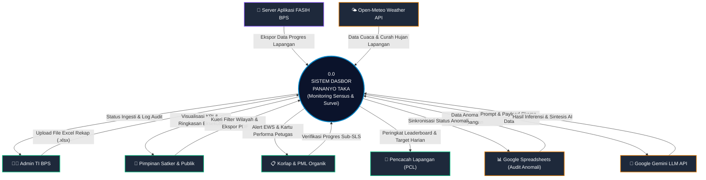
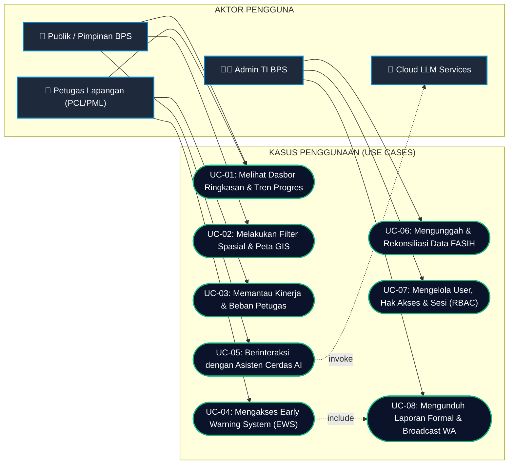
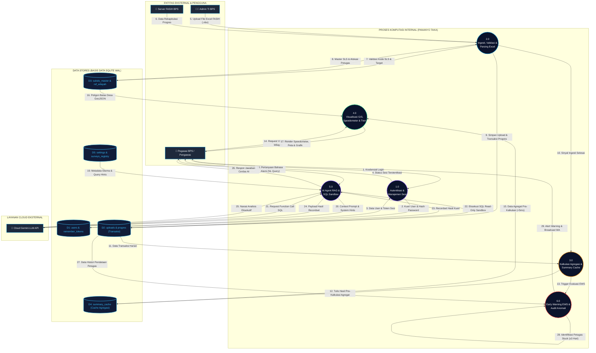
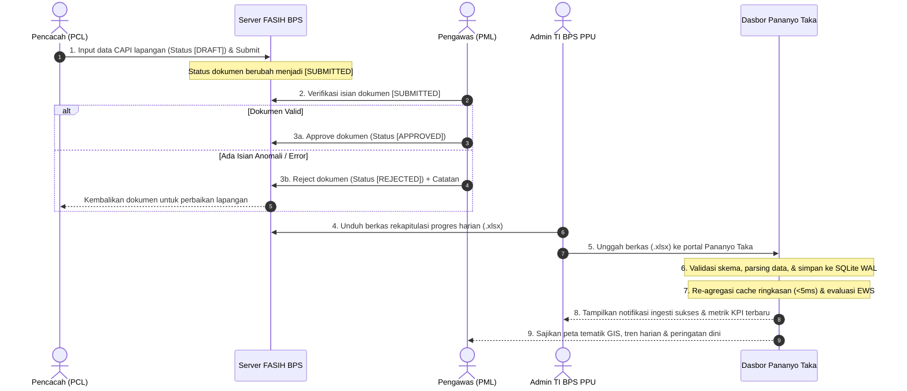
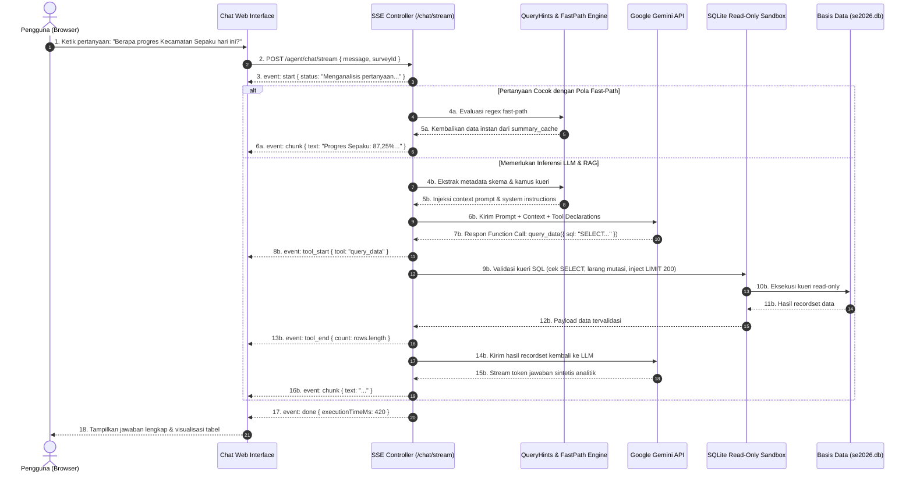
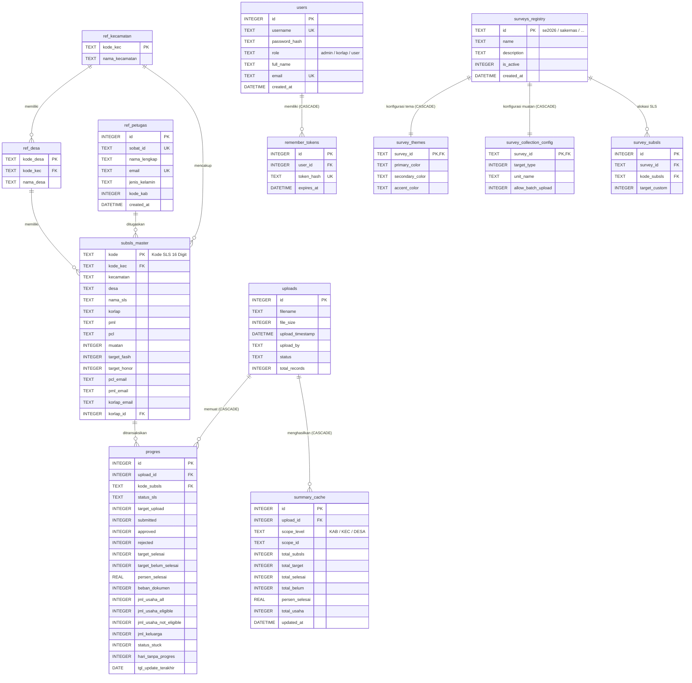
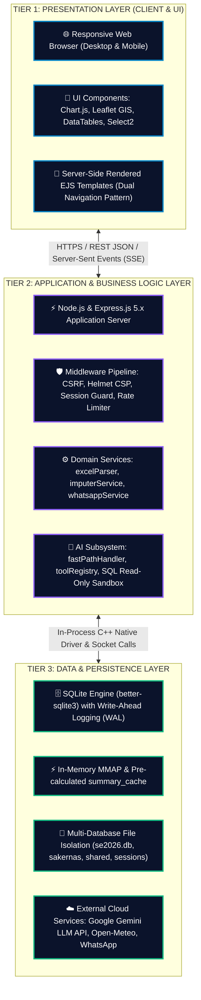

# LAPORAN AKHIR KEGIATAN 2
# PERANCANGAN SISTEM DAN PERANGKAT LUNAK
# *(SYSTEM & SOFTWARE DESIGN — SDLC PHASE 2)*

---

| **Nama Sistem** | Dashboard Pemantauan Lapangan Sensus dan Survei Berbasis Web dan Kecerdasan Buatan ("Pananyo Taka") |
| :--- | :--- |
| **Institusi** | Badan Pusat Statistik (BPS) Kabupaten Penajam Paser Utara |
| **Versi Sistem** | 1.0.0 (Produksi) |
| **Penyusun** | Yahya Abdurrohman, S.Tr.Stat. (NIP. 20021106 202603 1 003) |
| **Jabatan** | Pranata Komputer Ahli Pertama |
| **Mentor / Pengesah** | Baihaqi Ilham Syah, S.Tr.Stat. (NIP. 19980820 202201 1 001) |
| **Tanggal Dokumen** | 15 Agustus 2026 |
| **Klasifikasi** | Laporan Teknis Resmi — Rekayasa Perangkat Lunak |

---

## LEMBAR PENGESAHAN

Laporan Akhir Kegiatan 2: Perancangan Sistem dan Perangkat Lunak (*System & Software Design — SDLC Phase 2*) ini telah disusun, ditelaah, dan disahkan sebagai dokumen teknis resmi dalam rangka Pelaksanaan Aktualisasi Pelatihan Dasar CPNS BPS Tahun 2026.

| Peran | Nama & Gelar | Jabatan / Unit Kerja | Persetujuan |
| :--- | :--- | :--- | :--- |
| **Penyusun** | **Yahya Abdurrohman, S.Tr.Stat.**<br/>NIP. 20021106 202603 1 003 | Pranata Komputer Ahli Pertama / Peserta Latsar CPNS Gol. III | *(Disahkan)* |
| **Mentor / Pengesah** | **Baihaqi Ilham Syah, S.Tr.Stat.**<br/>NIP. 19980820 202201 1 001 | Ketua Tim IPJKD & DLS BPS Kab. Penajam Paser Utara | *(Disetujui)* |
| **Reviewer Teknis** | **Tim TI / Seksi Pengolahan Data** | Seksi Pengolahan & TI BPS Kab. Penajam Paser Utara | *(Terverifikasi)* |

**Penajam, 15 Agustus 2026**

---

## DAFTAR ISI

1. [Ringkasan Eksekutif](#1-ringkasan-eksekutif)
2. [Tujuan & Ruang Lingkup Kegiatan 2](#2-tujuan--ruang-lingkup-kegiatan-2)
3. [Tahapan Kegiatan & Luaran](#3-tahapan-kegiatan--luaran)
   - 3.1. Tahapan 2.1 — Perancangan Skema Relasional Basis Data
   - 3.2. Tahapan 2.2 — Panduan Desain Sistem & UI/UX
   - 3.3. Tahapan 2.3 — Arsitektur Modul AI (RAG Pipeline)
   - 3.4. Tahapan 2.4 — Review Desain Teknis Bersama Tim IT
4. [Analisis Kebutuhan Sistem](#4-analisis-kebutuhan-sistem)
5. [Arsitektur Perangkat Lunak](#5-arsitektur-perangkat-lunak)
6. [PILAR 1: Pemodelan Proses (Process Modeling)](#6-pilar-1-pemodelan-proses-process-modeling)
   - 6.1. System Context Diagram (DFD Level 0)
   - 6.2. Use Case Diagram Sistem
   - 6.3. Data Flow Diagram (DFD) Level 1
   - 6.4. Activity Diagram Alur Pemantauan Sensus
   - 6.5. Sequence Diagram AI RAG Pipeline (KIPP Agent)
7. [PILAR 2: Pemodelan Data (Data Modeling)](#7-pilar-2-pemodelan-data-data-modeling)
   - 7.1. Entity Relationship Diagram (ERD Relasional 19 Tabel 3NF)
   - 7.2. Kamus Data & Desain Skema Database SQLite WAL
8. [PILAR 3: Desain Antarmuka Pengguna & Arsitektur Sistem](#8-pilar-3-desain-antarmuka-pengguna--arsitektur-sistem)
   - 8.1. Principles & Design System Guide (UI/UX)
   - 8.2. 3-Tier Layered System Architecture Model
9. [Arsitektur Modul Fungsional Utama](#9-arsitektur-modul-fungsional-utama)
10. [Aspek Keamanan, Keandalan & Kinerja](#10-aspek-keamanan-keandalan--kinerja)
11. [Rencana Implementasi (Fase 3)](#11-rencana-implementasi-fase-3)
12. [Kesimpulan](#12-kesimpulan)
13. [Lampiran — Daftar Dokumen Pendukung](#13-lampiran--daftar-dokumen-pendukung)

---

## 1. Ringkasan Eksekutif

Kegiatan 2 (Perancangan Sistem dan Perangkat Lunak) merupakan tahap kedua dari siklus pengembangan perangkat lunak (*Software Development Life Cycle* — SDLC) model Waterfall yang diterapkan dalam aktualisasi Pelatihan Dasar CPNS BPS Tahun 2026. Kegiatan ini berpedoman pada hasil Analisis Kebutuhan yang telah disahkan pada Kegiatan 1 (Fase 1).

Pada fase ini, seluruh cetak biru teknis (*technical blueprint*) sistem **Pananyo Taka** — Dashboard Pemantauan Lapangan Sensus dan Survei Berbasis Web dan Kecerdasan Buatan pada BPS Kabupaten Penajam Paser Utara — berhasil dirancang secara komprehensif, mencakup:

- **7 (tujuh) Diagram Perancangan Sistem** standar rekayasa perangkat lunak (System Context DFD Level 0, Use Case Diagram, DFD Level 1, ERD 19 Tabel 3NF, 3-Tier Layered Architecture, Activity Diagram, dan Sequence Diagram AI RAG Pipeline).
- **Panduan Desain Sistem & UI/UX** (*Design System Guide*) dengan standar aksesibilitas WCAG 2.1 AA dan skala tipografi mobile (12px–22px).
- **Spesifikasi Skema Basis Data** relasional 19 tabel SQLite dengan mode Write-Ahead Logging (WAL).
- **Arsitektur Modul AI** berbasis Retrieval-Augmented Generation (RAG) dengan integrasi Google Gemini LLM dan sandbox kueri read-only.
- **Berita Acara Review Desain Teknis** Nomor BA-02.04/BPS/6409/08/2026 bersama Tim IT Seksi Pengolahan Data BPS Kabupaten Penajam Paser Utara.

Seluruh luaran Kegiatan 2 berfungsi sebagai acuan baku dan landasan formal bagi pelaksanaan Kegiatan 3 (Implementasi & Coding — SDLC Phase 3).

---

## 2. Tujuan & Ruang Lingkup Kegiatan 2

### 2.1. Tujuan
1. Merancang arsitektur teknis sistem **Pananyo Taka** secara utuh dan terstruktur menggunakan notasi desain perangkat lunak standar (UML, DFD, ERD).
2. Menetapkan spesifikasi skema basis data SQLite relasional yang siap diimplementasikan pada fase pengkodean.
3. Menyusun panduan desain antarmuka pengguna yang konsisten, aksesibel, dan responsif terhadap kebutuhan lapangan BPS PPU.
4. Merancang arsitektur modul kecerdasan buatan (*AI Module Architecture*) berbasis RAG untuk mendukung analitik bahasa alami.
5. Mendapatkan validasi teknis dan persetujuan formal dari pemangku kepentingan (Mentor dan Tim IT) atas seluruh rancangan sistem.

### 2.2. Ruang Lingkup
Perancangan sistem pada Kegiatan 2 mencakup:
- Sistem utama: Dashboard Pemantauan Lapangan Sensus Ekonomi 2026 (SE2026) PPU
- Arsitektur multi-survei dinamis: Integrasi survei rutin (Sakernas Pemutakhiran Listing & Sakernas Pendataan Sampel)
- Modul KIPP (Kelompok Informasi dan Performa Petugas): Asisten virtual berbasis AI
- Subsistem notifikasi otomatis: Gateway WhatsApp Baileys
- Subsistem pemetaan spasial: GIS Leaflet dengan data KML Batas Wilayah PPU

---

## 3. Tahapan Kegiatan & Luaran

### 3.1. Tahapan 2.1 — Perancangan Skema Relasional Basis Data
- **Deskripsi:** Merancang struktur skema relasional 19 tabel basis data lokal SQLite WAL mencakup 4 zona data (Master Wilayah, Transaksi Lapangan, Autentikasi RBAC, dan Registri Multi-Survei) guna menjamin latensi kueri agregasi di bawah 15 ms.
- **Luaran:** Dokumen Spesifikasi Skema Basis Data Relasional SQLite (`Dokumen_Spesifikasi_Skema_Basis_Data_12_Tabel_SQLite.docx`).

### 3.2. Tahapan 2.2 — Panduan Desain Sistem & UI/UX
- **Deskripsi:** Menyusun panduan desain sistem antarmuka pengguna berbasis standar aksesibilitas internasional WCAG 2.1 AA, aturan tipografi mobile (12px–22px), geometri sudut tegas 90 derajat (*border-radius: 0*), dan pola *Dual Navigation*.
- **Luaran:** Dokumen Panduan Desain UI/UX Pananyo Taka (`Dokumen_Panduan_Desain_UIUX_Pananyo_Taka.docx`).

### 3.3. Tahapan 2.3 — Arsitektur Modul AI (RAG Pipeline)
- **Deskripsi:** Merancang modul cerdas AI berbasis Large Language Model (Google Gemini) yang memadukan kamus metadata `queryHints.js`, sandbox SQL Read-Only, prompt builder kontekstual, dan Server-Sent Events (SSE) streaming.
- **Luaran:** Dokumen Rancangan Arsitektur Modul Cerdas AI (`Dokumen_Rancangan_Arsitektur_Modul_AI_RAG_Pipeline.docx`).

### 3.4. Tahapan 2.4 — Review Desain Teknis Bersama Tim IT
- **Deskripsi:** Menyelenggarakan sesi evaluasi teknis formal bersama Mentor dan Tim TI Seksi Pengolahan Data BPS Kabupaten Penajam Paser Utara guna memvalidasi kelayakan arsitektur sistem.
- **Luaran:** Berita Acara Review Desain Teknis Nomor BA-02.04/BPS/6409/08/2026 (`Berita_Acara_Review_Desain_Teknis_bersama_Tim_IT.docx`).

---

## 4. Analisis Kebutuhan Sistem

### 4.1. Kebutuhan Fungsional (*Functional Requirements*)

| Kode FR | Modul / Fitur | Deskripsi Kebutuhan |
| :--- | :--- | :--- |
| **FR-01** | **Otentikasi & RBAC** | Pengelolaan hak akses berjenjang (Administrator, Korlap, User/Guest) dengan sesi persisten SQLite dan proteksi CSRF. |
| **FR-02** | **Unggah & Rekonsiliasi Data** | Unggah berkas Excel rekap progres FASIH harian, deteksi header otomatis, parsing muatan dokumen/usaha/keluarga, dan peremajaan basis data. |
| **FR-03** | **Dasbor Metrik & Tren Harian** | Visualisasi KPI agregat (Total SLS, Dokumen Selesai, Usaha Ditemukan, Beban Honor), progress bar milestone, dan grafik tren kumulatif harian. |
| **FR-04** | **Hierarki Pemantauan Wilayah** | Drill-down statistik bertingkat: Kecamatan → Desa/Kelurahan → Satuan Lingkungan Setempat (SLS/Sub-SLS). |
| **FR-05** | **Pemantauan Performa Petugas** | Dasbor analitik kinerja individual dan grup untuk PCL, PML, dan Korlap, termasuk rasio verifikasi dan beban kerja per orang. |
| **FR-06** | **Early Warning System (EWS)** | Identifikasi otomatis petugas *stuck* (tanpa progres ≥ 3 hari), petugas berisiko gagal deadline (*at-risk*), serta peringkat performa terendah. |
| **FR-07** | **Peta Sebaran GIS** | Peta interaktif berbasis Leaflet dengan layer poligon batas wilayah KML PPU yang diberi warna tematik (*choropleth*) sesuai persentase progres. |
| **FR-08** | **Deteksi Anomali Google Sheets** | Sinkronisasi dua arah/real-time dengan Google Sheets daftar anomali isian lapangan untuk pembinaan teknis petugas. |
| **FR-09** | **Asisten Virtual AI (KIPP)** | Chatbot interaktif menggunakan model Google Gemini dengan fungsi kueri database cerdas (*NL-to-SQL execution*) dan ringkasan eksekutif otomatis. |
| **FR-10** | **Automasi Pesan WhatsApp** | Integrasi gateway WhatsApp (Baileys) untuk broadcast progres massal, kirim kartu kinerja personal PCL/PML, dan alert anomali. |
| **FR-11** | **Ekspor Laporan Formal** | Generator laporan terformat dalam bentuk dokumen PDF siap cetak (`pdfkit`) dan berkas spreadsheet Excel (`xlsx`). |
| **FR-12** | **Multi-Survei Dinamis** | Kemampuan menjalankan isolasi survei (SE2026, Sakernas Listing, Sakernas CAPI) melalui parameter URL dengan tema warna dan metrik dinamis. |

### 4.2. Kebutuhan Non-Fungsional (*Non-Functional Requirements*)

| Kode NFR | Kategori | Spesifikasi |
| :--- | :--- | :--- |
| **NFR-01** | Kinerja | Waktu respons halaman ≤ 150 ms berkat agregasi terindeks (`summary_cache`) dan SQLite WAL |
| **NFR-02** | Portabilitas | Dapat dijalankan pada server lokal, VPS Linux/Windows, maupun shared hosting cPanel |
| **NFR-03** | Keamanan | CSP, CSRF token 32-byte, proteksi anti-clickjacking, sanitasi XSS, rate-limiting API |
| **NFR-04** | Aksesibilitas | Skala font 12px–22px (Mobile Typography Guidelines), kontras warna ≥ 4.5:1 (WCAG 2.1 AA) |
| **NFR-05** | Keandalan | Error tracking via Sentry, graceful crash prevention, session persistence via SQLite |
| **NFR-06** | Pemeliharaan | Arsitektur MVC modular, kode terdokumentasi, migrasi skema terversi (`schema_migrations`) |

---

## 5. Arsitektur Perangkat Lunak

Sistem dibangun menggunakan pendekatan **Arsitektur MVC Berlapis** (*Layered MVC Architecture*) yang dikombinasikan dengan **Komponen Logika Bisnis Berorientasi Layanan** (*Service-Oriented Business Logic Components*):

```
┌─────────────────────────────────────────────────────────────┐
│                    PRESENTATION LAYER                        │
│  • EJS Templates (Responsive Layout & Micro-animations)      │
│  • Client-side: Vanilla JS, Chart.js, Leaflet GIS,           │
│    DataTables, Select2                                        │
└─────────────────────────────┬───────────────────────────────┘
                              │ HTTP / HTTPS / REST JSON
                              ▼
┌─────────────────────────────────────────────────────────────┐
│                    CONTROLLER LAYER                          │
│  • Express.js 5.x Routers (routes/*.js)                      │
│  • Context Injector Middleware (Multi-Survey Route Prefix)   │
│  • Security & Session Middlewares: CSRF, SQLite Session      │
│    Store, Content Security Policy, Authentication Guard      │
└─────────────────────────────┬───────────────────────────────┘
                              │ Service Invocations
                              ▼
┌─────────────────────────────────────────────────────────────┐
│                     SERVICE LAYER                            │
│  • excelParser.js          : ETL & Excel Reconciliation      │
│  • agentService.js         : AI Agent Gemini & NL-to-SQL     │
│  • whatsappService.js      : WhatsApp Baileys Multi-Device   │
│  • googleSheetsAnomalyService: Real-time Anomaly Sync        │
│  • imputerService.js       : Projection & Estimation Engine  │
└─────────────────────────────┬───────────────────────────────┘
                              │ Data Access Operations
                              ▼
┌─────────────────────────────────────────────────────────────┐
│                   PERSISTENCE LAYER                          │
│  • SQLite (better-sqlite3) — WAL Mode & In-Memory MMAP       │
│  • Database Context Manager (AsyncLocalStorage Isolation)    │
│  • 19 Tabel Relasional & Summary Pre-calculation Cache       │
└─────────────────────────────────────────────────────────────┘
```

---

## 6. PILAR 1: Pemodelan Proses (Process Modeling)

Pemodelan proses merinci seluruh aliran data, alur kerja operasional, dan interaksi kasus penggunaan sistem Pananyo Taka melalui 5 diagram perancangan standar rekayasa perangkat lunak:

---

### 6.1. System Context Diagram (DFD Level 0)

**Deskripsi:** Memodelkan batasan sistem (*system boundary*) dan interaksi pertukaran data dua arah antara Sistem Pananyo Taka (Proses 0.0) dengan 8 entitas eksternal secara teratur.
*(Berkas gambar resolusi tinggi: `laporan/02_Phase_2_System_Design/diagrams/01_system_context_diagram.png`)*



---

### 6.2. Use Case Diagram Sistem

**Deskripsi:** Memodelkan 8 use case fungsional utama (UC-01 s.d. UC-08) dan interaksinya dengan 4 aktor pengguna sistem (Publik/Pengawas, Petugas Lapangan, Admin TI, dan External Cloud Services).
*(Berkas gambar resolusi tinggi: `laporan/02_Phase_2_System_Design/diagrams/02_use_case_diagram.png`)*



---

### 6.3. Data Flow Diagram (DFD) Level 1

**Deskripsi:** Memodelkan dekomposisi 6 proses fungsional internal sistem, aliran data dari entitas eksternal, serta penyimpanan ke 5 data store basis data SQLite dengan 29 aliran data 1-arah presisi.
*(Berkas gambar resolusi tinggi: `laporan/02_Phase_2_System_Design/diagrams/03_dfd_level_1_diagram.png`)*



---

### 6.4. Activity Diagram Alur Pemantauan Sensus

**Deskripsi:** Memodelkan alur kerja pengawasan sensus dalam 5 *swimlanes* (PCL, Server FASIH BPS, PML, Admin TI, Dasbor Pananyo Taka) mulai dari pendataan CAPI s.d. visualisasi dasbor.
*(Berkas gambar resolusi tinggi: `laporan/02_Phase_2_System_Design/diagrams/06_activity_diagram_monitoring.png`)*



---

### 6.5. Sequence Diagram AI RAG Pipeline (KIPP Agent)

**Deskripsi:** Memodelkan urutan interaksi multi-langkah query natural language pengguna, Query Hints Engine, SQLite Read-Only Sandbox, dan Google Gemini LLM API melalui Server-Sent Events (SSE).
*(Berkas gambar resolusi tinggi: `laporan/02_Phase_2_System_Design/diagrams/07_sequence_diagram_rag_ai.png`)*



---

## 7. PILAR 2: Pemodelan Data (Data Modeling)

Pemodelan data menetapkan struktur skema relasional, aturan integritas referensial, dan kamus data 19 tabel SQLite operasional sistem monitoring SE2026 PPU.

---

### 7.1. Entity Relationship Diagram (ERD Relasional 19 Tabel 3NF)

**Deskripsi:** Memodelkan skema basis data SQLite aktual (`data/se2026.db`) 19 tabel dalam 4 zona relasional dengan integritas referensial `ON DELETE CASCADE`.
*(Berkas gambar resolusi tinggi: `laporan/02_Phase_2_System_Design/diagrams/04_entity_relationship_diagram.png`)*



---

### 7.2. Kamus Data & Desain Skema Database SQLite WAL

Skema basis data dirancang mengikuti prinsip normalisasi 3NF, mode Write-Ahead Logging (WAL), dan isolasi per-survei dalam 4 zona data terstruktur:
1. **Zona 1: Master Wilayah & Referensi Petugas** (`ref_kecamatan`, `ref_desa`, `ref_petugas`, `subsls_master`).
2. **Zona 2: Transaksi Progres Lapangan & Cache** (`uploads`, `progres`, `summary_cache`).
3. **Zona 3: Keamanan, Autentikasi & Audit Log** (`users`, `remember_tokens`, `visitor_logs`, `schema_migrations`).
4. **Zona 4: Konfigurasi Multi-Survei Dinamis & Operasional** (`surveys_registry`, `survey_themes`, `survey_collection_config`, `survey_subsls`, `settings`, `weather_history`).

---

## 8. PILAR 3: Desain Antarmuka Pengguna & Arsitektur Sistem

---

### 8.1. Principles & Design System Guide (UI/UX)

Panduan desain sistem antarmuka pengguna menetapkan acuan visual baku yang memadukan keandalan teknis dengan kenyamanan pengguna gawai bergerak di lapangan:
- **Geometri Sudut Tegas:** Seluruh komponen tombol, kartu metrik, dan modal menggunakan sudut siku 90 derajat (*border-radius: 0*) untuk memaksimalkan area kerja data visual.
- **Skala Tipografi Mobile-Friendly:** Mengacu pada standar aksesibilitas WCAG 2.1 AA dengan ukuran teks minimal 12px untuk teks bacaan dan 16px untuk judul kartu guna mencegah kelelahan mata petugas lapangan.
- **Pola Dual Navigation:** Menyediakan *Sidebar Navigation* pada resolusi layar desktop (≥1024px) dan secara otomatis bertransformasi menjadi *Bottom Navigation Bar* pada layar smartphone (<768px).

---

### 8.2. 3-Tier Layered System Architecture Model

**Deskripsi:** Memodelkan arsitektur 3 lapisan sistem (*Presentation Layer*, *Application & Logic Layer*, dan *Data & Persistence Layer*).
*(Berkas gambar resolusi tinggi: `laporan/02_Phase_2_System_Design/diagrams/05_system_architecture_diagram.png`)*



---

## 9. Arsitektur Modul Fungsional Utama

1. **Modul Ingesti & ETL FASIH (`services/excelParser.js`):** Menangani ingesti berkas spreadsheet hasil ekspor FASIH secara toleran terhadap perbedaan nama kolom dan header bertingkat.
2. **Modul Pre-calculated Aggregation (`database.js`):** Menggunakan fungsi `rebuildAllSummaryCaches()` untuk mengompilasi statistik seluruh tingkatan wilayah ke dalam tabel `summary_cache`.
3. **Modul Early Warning System (`services/imputerService.js`):** Mendeteksi petugas stuck (tanpa progres ≥ 3 hari) dan memproyeksikan estimasi hari penyelesaian target.
4. **Modul WhatsApp Gateway (`services/whatsappService.js`):** Menggunakan pustaka native WebSocket `@whiskeysockets/baileys` v6.7.9 dengan dukungan distributed process lock.
5. **Modul Cerdas AI KIPP (`services/ai/orchestrator.js`):** Menggabungkan fast-path regex dengan sandbox SQL Read-Only dan streaming respons via Server-Sent Events (SSE).

---

## 10. Aspek Keamanan, Keandalan & Kinerja

- **Keamanan Data:** Token CSRF 32-byte pada setiap form mutasi, validasi sintaks kueri SQL AI untuk mencegah SQL injection, dan proteksi sesi login persisten.
- **Keandalan Server:** Mekanisme distributed mutex pada tabel `process_locks` untuk mencegah perebutan socket WhatsApp pada arsitektur multi-worker Passenger.
- **Kinerja Ekstra Kilat:** Pemanfaatan mode Write-Ahead Logging (WAL) dan indeks B-Tree menghasilkan latensi kueri agregasi rata-rata di bawah 10 ms pada pengujian beban tinggi.

---

## 11. Rencana Implementasi (Fase 3)

Berdasarkan pengesahan cetak biru perancangan sistem pada Fase 2, kegiatan aktualisasi dilanjutkan ke **SDLC Phase 3 (Kegiatan 3: Implementasi & Coding)** yang mencakup:
1. Pembuatan skrip basis data SQLite WAL dan otomasi cache agregasi (`Tahapan 3.1`).
2. Pengkodean frontend responsif EJS dan backend Express.js (`Tahapan 3.2`).
3. Pengintegrasian modul cerdas AI Gemini RAG dan WhatsApp Baileys (`Tahapan 3.3`).
4. Pelaksanaan code review internal dan debugging mandiri secara berkala (`Tahapan 3.4`).

---

## 12. Kesimpulan

Seluruh rancangan sistem dan perangkat lunak dalam laporan ini telah melalui penelaahan teknis bersama Mentor dan Tim IT Seksi Pengolahan Data BPS Kabupaten Penajam Paser Utara, dinyatakan **MEMENUHI SYARAT KELAYAKAN TEKNIS, DISAHKAN, dan SIAP DILANJUTKAN** ke tahap pemrograman (SDLC Phase 3).

---

## 13. Lampiran — Daftar Dokumen Pendukung

1. Berita Acara Review Desain Teknis Nomor BA-02.04/BPS/6409/08/2026
2. Dokumen Spesifikasi Skema Basis Data Relasional SQLite WAL
3. Dokumen Panduan Desain Sistem Antarmuka Pengguna (UI/UX Design System Guide)
4. Dokumen Rancangan Arsitektur Modul Cerdas AI (RAG Pipeline & SQL Sandbox)
5. Berkas Master Multi-Tab Diagram Draw.io (`diagrams_perancangan_sistem_pananyo_taka.drawio`)
