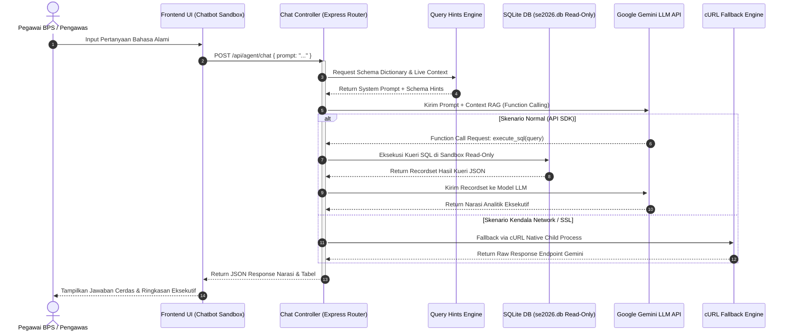

# DOKUMEN RANCANGAN ARSITEKTUR MODUL CERDAS AI
# *(RETRIEVAL-AUGMENTED GENERATION & MULTI-PROVIDER LLM FALLBACK ENGINE)*
# ASISTEN VIRTUAL KIPP — PANANYO TAKA BPS PPU

---

| **Nama Modul** | Modul KIPP (*Kelompok Informasi & Performa Petugas*) — Asisten AI |
| :--- | :--- |
| **Sistem Utama** | Dashboard Pemantauan Lapangan SE2026 & Multi-Survei BPS PPU |
| **Institusi** | Badan Pusat Statistik (BPS) Kabupaten Penajam Paser Utara |
| **Versi Arsitektur** | 2.3.0 (SDLC Phase 2 Final) |
| **Penyusun** | Yahya Abdurrohman (Pranata Komputer Ahli Pertama) |
| **Pengesah** | Ketua Tim IPJKD & DLS BPS Kab. PPU (Ketua Tim IPJKD & DLS BPS Kab. PPU) |
| **Tanggal Dokumen** | 15 Agustus 2026 |

---

## 1. RINGKASAN ARSITEKTUR MODUL AI

Modul Asisten Virtual AI **KIPP** (*Kelompok Informasi dan Performa Petugas*) dirancang menggunakan pendekatan **Retrieval-Augmented Generation (RAG)** yang terintegrasi langsung dengan basis data SQLite operasional sistem monitoring (*se2026.db*). Modul ini memungkinkan pimpinan, pengawas, dan korlap mengajukan pertanyaan analitis dalam bahasa Indonesia alami (*Natural Language Querying*) dan memperoleh jawaban instan berupa naskah ringkasan eksekutif dan tabel statistik.

---

## 2. KOMPONEN UTAMA ARSITEKTUR AI

### 2.1. System Prompt & Schema Injection Engine
Mekanisme injeksi konteks dinamis yang menggabungkan:
1. **Metadata Skema Database 19 Tabel:** Kamus tabel dan kolom terstruktur (`subsls_master`, `progres`, `summary_cache`, dll.).
2. **Kamus Domain BPS (*Query Hints*):** Istilah PCL, PML, Korlap, Muatan, SubSLS, FASIH, Dokumen Approved/Submitted.
3. **Snapshot Rekapitulasi Real-Time:** Injeksi angka agregat capaian kabupaten secara otomatis ke dalam System Prompt.

### 2.2. SQL Tool Sandbox (Read-Only Execution)
Mekanisme *Function Calling* yang mengeksekusi kueri SQL hasil generasi model AI:
- **Hak Akses Terbatas:** Hanya mengizinkan perintah `SELECT` (Read-Only). Perintah `INSERT`, `UPDATE`, `DELETE`, `DROP` ditolak otomatis oleh sandbox.
- **Pembatasan Batas Kueri:** Otomatis menambahkan `LIMIT 100` pada kueri untuk mencegah *memory overflow*.

### 2.3. Multi-Provider LLM Orchestrator & Fallback
- **Primary LLM:** Google Gemini (`Gemini 2.5 Flash / Gemini 3.5 Flash`) via SDK `@google/generative-ai`.
- **Fallback Provider 1:** OpenAI API (`GPT-4o / GPT-5.5`).
- **Fallback Provider 2:** OpenRouter (`Llama 3.3 70B / Nemotron`).

### 2.4. Self-Healing Network (cURL Native Fallback Engine)
Ketika terjadi pembatasan port HTTPS outbound atau kendala SSL handshake pada server *shared hosting* cPanel Dewaweb, modul secara otomatis beralih menggunakan `child_process.execFile('curl', ...)` untuk mengeksekusi panggilan API via binary cURL sistem lokal.

---

## 3. ALUR KERJA (SEQUENCE DIAGRAM RAG PIPELINE)

---

## 4. KEAMANAN & PEMBATASAN AKSES

1. **Middleware Guard:** Proteksi `requireLogin` untuk memastikan hanya pengguna terdaftar yang dapat menggunakan fitur AI.
2. **Rate Limiting:** Pembatasan maksimal 10 permintaan per menit per akun pengguna.
3. **Input Sanitization:** Pembersihan karakter berbahaya dan pembatasan panjang prompt maksimal 2.000 karakter.

---

*Disetujui dan Disahkan oleh Ketua Tim IPJKD & DLS BPS Kabupaten Penajam Paser Utara, 15 Agustus 2026*
