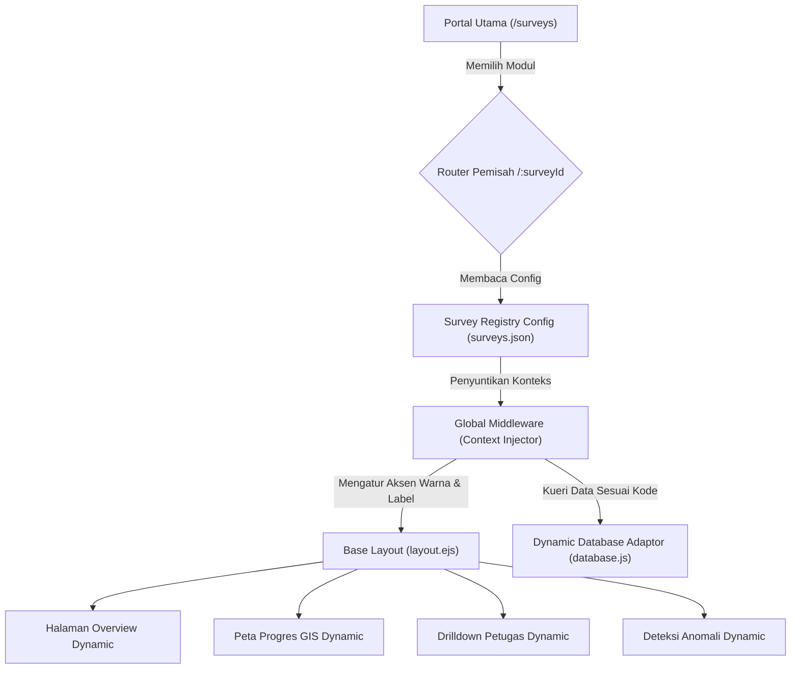

# Rancangan Implementasi: Arsitektur Dasbor Dinamis Berbasis Templat (*Multi-Survey Template System*)

Dokumen ini memuat rancangan arsitektur untuk mengubah Dasbor Sensus Ekonomi 2026 menjadi sebuah **templat dasbor generik yang dinamis**. Dengan pendekatan ini, modul dasbor baru (seperti Sakernas, Susenas, dll.) dapat ditambahkan hanya melalui file konfigurasi JSON, dengan tata letak, fitur, dan database yang terisolasi serta tema warna yang dapat disesuaikan secara otomatis.

---

## 1. Diagram Arsitektur Sistem



---

## 2. Rincian Desain Implementasi

### Langkah 1: Registrasi Kegiatan (*Survey Config Registry*)
Buat berkas konfigurasi [`config/surveys.json`](file:///d:/SE2026/monitoring-se2026-ppu/config/surveys.json) sebagai pusat pendaftaran seluruh kegiatan sensus/survei.

```json
{
  "se2026": {
    "name": "Sensus Ekonomi 2026",
    "shortName": "SE2026",
    "desc": "Pendaftaran Lengkap Usaha/Perusahaan",
    "theme": "orange",
    "themeColor": "#f97316",
    "themeRgb": "249, 115, 22",
    "unitName": "dokumen",
    "dbSuffix": "se",
    "enabledPages": ["map", "agent", "korlap", "pml", "pcl", "earlywarning", "deteksi-anomali", "performa", "harian", "leaderboard", "kecamatan", "subsls", "export"]
  },
  "sakernas-pemutakhiran": {
    "name": "Sakernas — Pemutakhiran",
    "shortName": "Sakernas Listing",
    "desc": "Listing Rumahtangga & Blok Sensus",
    "theme": "cyan",
    "themeColor": "#06b6d4",
    "themeRgb": "6, 182, 212",
    "unitName": "keluarga",
    "dbSuffix": "sakernas_listing",
    "enabledPages": ["map", "agent", "pml", "pcl", "earlywarning", "deteksi-anomali", "harian", "leaderboard", "kecamatan", "subsls", "export"]
  },
  "sakernas-pendataan": {
    "name": "Sakernas — Pendataan",
    "shortName": "Sakernas CAPI",
    "desc": "Pencacahan Sampel Ketenagakerjaan",
    "theme": "purple",
    "themeColor": "#7c3aed",
    "themeRgb": "124, 58, 237",
    "unitName": "sampel RT",
    "dbSuffix": "sakernas_pendataan",
    "enabledPages": ["map", "agent", "pml", "pcl", "performa", "harian", "leaderboard", "kecamatan", "subsls", "export"]
  }
}
```

---

### Langkah 2: Middleware Konteks Dinamis (*Context Injector*)
Di server utama (`server.js`), buat middleware untuk menangkap kode survei dari URL dan menyuntikkan pengaturannya ke dalam sesi dan variabel template (`res.locals`):

```javascript
// Middleware untuk menangani rute berparameter /:surveyId
app.use('/:surveyId', (req, res, next) => {
  const surveysConfig = require('./config/surveys.json');
  const surveyId = req.params.surveyId;

  if (surveysConfig[surveyId]) {
    const config = surveysConfig[surveyId];
    res.locals.activeSurvey = surveyId;
    res.locals.surveyConfig = config;
    res.locals.routePrefix = `/${surveyId}`;
    
    // Override tema warna CSS secara dinamis untuk Layout
    res.locals.customStyles = `
      :root {
        --accent-primary: ${config.themeColor};
        --accent-rgb: ${config.themeRgb};
        --accent-orange: ${config.themeColor};
      }
    `;
    next();
  } else {
    // Jika bukan rute survei, lanjutkan ke rute default (SE2026)
    next();
  }
});
```

---

### Langkah 3: Penyesuaian Variabel pada Layout & View (EJS)
Semua halaman EJS akan membaca label metrik dan navigasi secara dinamis dari objek `surveyConfig`:

1. **Sidebar Navigation (`views/layout.ejs`)**:
   Menggunakan `enabledPages` untuk menampilkan/menyembunyikan menu secara otomatis.
   ```ejs
   <% if (surveyConfig.enabledPages.includes('map')) { %>
     <a href="<%= routePrefix %>/map" class="nav-item">Peta Progres</a>
   <% } %>
   ```

2. **Terminologi Dinamis di Overview (`views/overview.ejs`)**:
   Kata "dokumen", "keluarga", atau "usaha" akan digantikan secara dinamis berdasarkan unit kegiatan:
   ```ejs
   <span>Realisasi: <b><%= summary.realisasi %></b> <%= surveyConfig.unitName %></span>
   ```

3. **Penyuntikan Warna CSS Aksen**:
   Menyisipkan `<style><%- customStyles %></style>` di dalam tag `<head>` pada `layout.ejs` untuk mengubah warna tombol, badge, progress bar, dan chart secara otomatis tanpa perlu menulis CSS baru.

---

### Langkah 4: Pemisahan Data SQLite (*Multi-Tenant Database*)
Agar data masing-masing survei aman dan tidak bercampur, database adaptor (`database.js`) akan membaca tabel secara dinamis berdasarkan suffix database survei (`dbSuffix`):

- **Opsi A (Single DB - Table Keying)**:
  Kueri membaca tabel `progres_[dbSuffix]` dan `uploads_[dbSuffix]`.
  *Contoh*: `SELECT * FROM progres_sakernas_listing WHERE upload_id = ?`

- **Opsi B (Multi DB - Database per Kegiatan)**:
  Membuka koneksi SQLite terpisah untuk setiap survei.
  *Contoh*: `const db = new Database('./data/monitoring_' + config.dbSuffix + '.db');`

---

## 3. Keunggulan Arsitektur Templat Ini
1. **Zero Code Duplication**: Tidak perlu menyalin file `.ejs` atau berkas JS baru setiap ada survei baru.
2. **Skalabilitas Tinggi**: BPS PPU dapat merilis dasbor baru untuk Susenas, SUTAS, atau Survei Konstruksi dalam waktu kurang dari 5 menit hanya dengan menambahkan entri baru di berkas konfigurasi.
3. **Kemudahan Pemeliharaan**: Perubahan fitur pada dasbor utama (SE2026) otomatis akan langsung dinikmati oleh seluruh dasbor survei lainnya.
